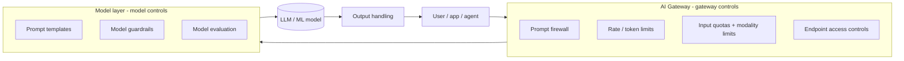

# Domain 2.0 — Securing AI Systems (40%)

Unofficial study material aligned to CompTIA SecAI+ CY0-001 V1 objectives — verify against the official objectives. See [../exam-objectives.md](../exam-objectives.md).

---

## What this domain tests

Domain 2 is **40% of the exam** — roughly **24 of 60 questions**. It is the single most important chapter in this guide. Where Domain 1 taught you to *speak* AI and Domain 3/4 cover *using* and *governing* AI, Domain 2 is the **hands-on defender** domain: model threats, the controls that stop them, access control, data security, monitoring, and — the heaviest objective — **reading the evidence of an attack and prescribing the right compensating control**.

The six objectives:

- **2.1** — Use AI **threat-modeling resources** (OWASP, MIT AI Risk Repository, MITRE ATLAS, CVE AI Working Group, threat-modeling frameworks).
- **2.2** — Implement **security controls** for AI systems (model controls, gateway controls, guardrail testing).
- **2.3** — Implement **access controls** (model, data, agent, network/API).
- **2.4** — Implement **data security controls** (encryption in transit / at rest / in use; data safety).
- **2.5** — Implement **monitoring and auditing** (prompt/log monitoring, confidence, rate, cost, quality/compliance auditing).
- **2.6** — **Analyze evidence of an attack and suggest compensating controls** (22 named attacks → evidence → control).

Expect performance-based items: "drag the control to the threat," "given these logs, name the attack," "select the compensating controls for this scenario." Memorize the attack→evidence→control mappings cold.

---

## 2.1 Given a scenario, use AI threat-modeling resources

Threat modeling = systematically identifying *what can go wrong*, *who would do it*, and *what you'll do about it* — **before** an incident. For AI you don't start from a blank page; the field has curated resources. The exam wants you to **recognize each resource, know what it contains, and pick the right one for a scenario.**

| Resource | What it is | Reach for it when… |
|---|---|---|
| **OWASP Top 10 for LLM Applications** | Community top-10 list of the most critical **LLM/GenAI** application risks (2025 edition, LLM01–LLM10) | Building or reviewing an **LLM app / chatbot / RAG / agent** |
| **OWASP Machine Learning Security Top 10** | Top-10 list focused on **classic ML** model risks (ML01–ML10) | Securing **traditional ML** (classifiers, fraud/anomaly models) |
| **MIT AI Risk Repository** | A large, living **database + taxonomy** of AI risks extracted from dozens of frameworks | You need a **comprehensive risk catalog** to make sure nothing is missed |
| **MITRE ATLAS** | ATT&CK-style **adversarial knowledge base** of real tactics/techniques against AI | Mapping **adversary behavior**, red-teaming, detections |
| **CVE AI Working Group** | The CVE Program's effort to standardize **AI vulnerability identification** (CVE IDs for AI) | Tracking/disclosing a specific **AI vulnerability** consistently |
| **Threat-modeling frameworks** | General methods (STRIDE, attack trees, PASTA, kill chains) **applied to AI** | Structuring the *process* of finding threats in a design |

### OWASP Top 10 for LLM Applications (2025)

The flagship resource for **generative AI / LLM** application security. Know all ten by ID — they reappear across Domain 2.6 and the practice tests.

| ID | Name (2025) | One-line meaning |
|---|---|---|
| **LLM01** | **Prompt Injection** | Crafted input (direct or indirect) overrides intended instructions/behavior. |
| **LLM02** | **Sensitive Information Disclosure** | Model leaks PII, secrets, proprietary data, or training data. |
| **LLM03** | **Supply Chain** | Compromised third-party models, datasets, plugins, or dependencies. |
| **LLM04** | **Data and Model Poisoning** | Tampered training/fine-tuning/embedding data corrupts model behavior. |
| **LLM05** | **Improper Output Handling** | Downstream systems trust model output → XSS, SSRF, SQLi, RCE. |
| **LLM06** | **Excessive Agency** | Model/agent has too much autonomy, permissions, or tool access. |
| **LLM07** | **System Prompt Leakage** | The system/developer prompt (and secrets in it) gets exposed. |
| **LLM08** | **Vector and Embedding Weaknesses** | Flaws in RAG: embedding inversion, cross-tenant leakage, retrieval poisoning. |
| **LLM09** | **Misinformation** | Confident but false output (hallucination) treated as fact. |
| **LLM10** | **Unbounded Consumption** | Resource exhaustion / runaway cost / model DoS (incl. "denial of wallet"). |

> #### 🎯 Exam tip — 2025 renames
> The 2025 list **renamed** several items vs. the older (2023) version: *Insecure Output Handling → Improper Output Handling (LLM05)*; *Model Denial of Service → Unbounded Consumption (LLM10)*; *Training Data Poisoning → Data and Model Poisoning (LLM04)*. It also **added** LLM07 System Prompt Leakage and LLM08 Vector and Embedding Weaknesses. If a question still uses the old names ("Insecure Output Handling," "Model DoS"), they map to LLM05 and LLM10.

### OWASP Machine Learning Security Top 10

The **classic-ML** sibling of the LLM list. Where the LLM Top 10 is about prompts, agents, and RAG, the ML Top 10 is about **models, training data, and inference APIs**. Many of the Domain 2.6 attacks come straight from here:

- **ML01 Input Manipulation Attack** — adversarial examples / evasion at inference.
- **ML02 Data Poisoning Attack** — corrupt the training data.
- **ML03 Model Inversion Attack** — reconstruct private training inputs from the model.
- **ML04 Membership Inference Attack** — determine whether a record was in the training set.
- **ML05 Model Theft** — steal/replicate the model (extraction).
- **ML06 AI Supply Chain Attacks** — compromise components/dependencies.
- **ML07 Transfer Learning Attack** — abuse a tainted pre-trained/base model that others fine-tune from.
- **ML08 Model Skewing** — shift the model's behavior over time (e.g., poisoning a feedback loop).
- **ML09 Output Integrity Attack** — tamper with results *between* model and consumer.
- **ML10 Model Poisoning** — alter the model's **parameters/weights** directly.

> #### 🎯 Exam tip — which OWASP list?
> "Chatbot / RAG / agent / prompt" → **LLM Top 10**. "Classifier / fraud model / training pipeline / adversarial examples" → **ML Security Top 10**. A scenario that mentions *prompts or LLMs* almost always wants the LLM list.

### MIT AI Risk Repository

MIT's **database and taxonomy of AI risks** — a single, living catalog that consolidates risks extracted from dozens of existing frameworks and papers into one searchable resource. Its value is **comprehensiveness**: it's the "did we miss anything?" reference. It organizes risks two ways:

- **Causal Taxonomy** — classifies *how/when* a risk arises by **Entity** (human vs. AI), **Intentionality** (intentional vs. unintentional), and **Timing** (pre-deployment vs. post-deployment).
- **Domain Taxonomy** — classifies *what kind* of risk it is across domains such as **discrimination & toxicity, privacy & security, misinformation, malicious actors & misuse, human–computer interaction, socioeconomic & environmental harms, and AI system safety/failures/limitations**.

On the exam, the MIT AI Risk Repository is the answer when a scenario calls for a **broad, structured inventory/taxonomy of AI risks** rather than a specific adversary-technique catalog (ATLAS) or a top-10 priority list (OWASP).

### MITRE ATLAS

**ATLAS** = *Adversarial Threat Landscape for Artificial-Intelligence Systems*. It is the **AI counterpart to MITRE ATT&CK**: a knowledge base of **tactics and techniques** that real adversaries use against AI/ML systems, plus documented case studies. Structure mirrors ATT&CK — adversary goals are **tactics** (the *why*) and the methods are **techniques** (the *how*), arranged in a matrix.

ATLAS tactics (by name) include: **Reconnaissance, Resource Development, Initial Access, AI Model Access, Execution, Persistence, Privilege Escalation, Defense Evasion, Credential Access, Discovery, Collection, AI Attack Staging, Command and Control, Exfiltration, and Impact.** Note the AI-specific tactics — **AI Model Access** and **AI Attack Staging** — that don't exist in classic ATT&CK.

> #### 🎯 Exam tip — ATLAS technique IDs
> ATLAS techniques use `AML.T####` identifiers (the "AML" = Adversarial Machine Learning). **Do not memorize specific numbers** — exam-author guidance for this guide is to reference ATLAS **tactics by name**, not fabricated IDs. Know that ATLAS = ATT&CK-for-AI (tactics + techniques + real-world case studies), used for **red-teaming, threat intel, and detection mapping**.

### CVE AI Working Group

The **CVE Program** (the system behind `CVE-YYYY-NNNNN` identifiers and CNAs/CVE Numbering Authorities) stood up an **AI Working Group** to figure out how the CVE process applies to **AI/ML vulnerabilities**. The hard questions it addresses: *Is a jailbreak a "vulnerability" or expected probabilistic behavior? How do you assign a CVE to a model, dataset, or prompt-level flaw? What counts as a fixable defect vs. inherent model limitation?* Its goal is **consistent, interoperable identification and disclosure** of AI vulnerabilities so the whole industry can track and remediate them the same way it tracks software CVEs.

On the exam: CVE AI Working Group = the resource for **standardized identification/cataloging of a specific AI vulnerability** (so it can be tracked and disclosed), *not* a top-10 list or a taxonomy.

### Threat-modeling frameworks applied to AI

General threat-modeling methods still work — you just apply them to AI assets (models, prompts, training data, vector stores, agents, tool integrations). The two the exam most likely names:

- **STRIDE** — Microsoft's mnemonic for threat categories: **S**poofing, **T**ampering, **R**epudiation, **I**nformation disclosure, **D**enial of service, **E**levation of privilege. Mapped to AI:

  | STRIDE | AI example |
  |---|---|
  | **Spoofing** | Impersonating a user/agent identity to an AI API |
  | **Tampering** | Data/model **poisoning**; altering weights or training data |
  | **Repudiation** | No prompt/response logging → can't prove what the model did |
  | **Information disclosure** | **Sensitive info disclosure**, model inversion, membership inference, system-prompt leakage |
  | **Denial of service** | **Model DoS / unbounded consumption** (token floods, "denial of wallet") |
  | **Elevation of privilege** | **Excessive agency**, prompt injection that abuses tool permissions |

- **Attack trees** — a root goal (e.g., "exfiltrate training data") decomposed into branches of sub-goals and leaf techniques (model inversion, membership inference, prompt-injected exfiltration). Good for reasoning about *paths* to a compromise.
- Others you may see referenced: **PASTA** (risk-centric, 7 stages), **kill chains**, and **DREAD** (risk scoring).

> #### 🎯 Exam tip — resource selection
> - Need a **prioritized top-10** for an LLM app → **OWASP LLM Top 10**.
> - Securing a **classic ML model/pipeline** → **OWASP ML Security Top 10**.
> - Need the **broadest risk inventory/taxonomy** → **MIT AI Risk Repository**.
> - Mapping **adversary tactics/techniques** (red team / threat intel) → **MITRE ATLAS**.
> - **Identifying/disclosing one specific AI vulnerability** consistently → **CVE AI Working Group**.
> - Structuring the **process** of finding threats in a design → **STRIDE / attack trees**.

---

## 2.2 Given a set of requirements, implement security controls for AI systems

This objective is about **building the defensive stack** around an AI system. Two layers — **model controls** (close to the model) and **gateway controls** (in front of the model, at the network/API edge) — plus the discipline of **testing the guardrails you deployed**.

### Model controls

Controls applied at or around the model itself.

- **Model evaluation** — systematically testing the model **before deployment and on an ongoing basis** for accuracy, robustness, safety, bias/fairness, and resistance to adversarial input. This is your gate: a model that fails eval (e.g., jailbreaks easily, leaks data, hallucinates badly) shouldn't ship. Evaluation also produces the baseline you later monitor against (2.5).
- **Model guardrails** — runtime constraints that keep model behavior within policy: refusing disallowed content, blocking unsafe tool calls, filtering toxic/PII output, enforcing topic boundaries. Guardrails sit on **both** the input and the output side.
  - **Prompt templates** — a key guardrail technique. Instead of passing raw user text to the model, you wrap it in a **fixed, vetted template** that (a) sets the system role/instructions, (b) clearly **delimits** untrusted user input from trusted instructions, and (c) constrains the task and output format. Templates reduce prompt-injection surface and make behavior reproducible. (Templates also appear in Domain 1.3 prompt engineering — here they're a **security** control.)

### Gateway controls

The **AI gateway** is a reverse-proxy / policy-enforcement point in front of the model (often called an **AI firewall** or **LLM gateway**). It enforces controls **before** requests reach the model and **after** responses leave it.

- **Prompt firewalls** — inspect incoming prompts (and sometimes outgoing responses) for injection attempts, jailbreak patterns, policy violations, secrets, and malicious payloads — and block/sanitize them. Think "WAF for prompts."
- **Rate limits** — cap **requests per unit time** per user/key/IP. Primary defense against **model DoS / unbounded consumption** and brute-force extraction.
- **Token limits** — cap **tokens per request and/or per window** (input + output). Bounds cost and blunts context-stuffing and runaway-generation abuse.
- **Input quotas** — limits on how much a caller may submit:
  - **Data size** — max payload/prompt size (e.g., reject 5 MB documents).
  - **Quantity** — max number of items/requests (batch size, files per call).
- **Modality limits** — restrict **which input types** are accepted (text only? images? audio? file uploads?). Disallowing unneeded modalities shrinks the attack surface (e.g., blocking image input that could hide injection text).
- **Endpoint access controls** — who/what may reach the model endpoint at all: authentication, API keys, allow-lists, mTLS, network segmentation. Overlaps with 2.3.

**Guardrails act on both sides of the model.** Know which side a given check belongs to:

| Input-side guardrails (before the model) | Output-side guardrails (after the model) |
|---|---|
| Injection/jailbreak detection | PII / secret leakage detection & redaction |
| Topic / policy scoping | Toxicity & content-policy filtering |
| PII detection in prompts | Hallucination / low-confidence flagging |
| Prompt-template enforcement & input delimiting | Output sanitization/encoding (vs. insecure output handling) |
| Size / modality validation | Unsafe tool-call / action blocking |

> #### 🎯 Exam tip — model vs. gateway control
> If the control lives **in front of** the model and applies to traffic (firewall, rate/token limit, quotas, endpoint auth) → **gateway control**. If it's **about the model's own behavior** (evaluation, guardrails, prompt templates) → **model control**. A "prompt firewall" is a gateway control; a "prompt template" is a model control — don't confuse them.

### Guardrail testing and validation

Deploying guardrails is not enough — you must **prove they work** and keep working.

- **Red-teaming / adversarial testing** — actively attack your own guardrails with injection, jailbreak, and evasion attempts (manually and with automated tools) to find bypasses.
- **Test suites / regression tests** — a curated battery of known-bad prompts run on every model or prompt change, so an update doesn't silently re-open a hole.
- **Benchmarks & evaluation harnesses** — measure refusal rates, false-positive (over-blocking) rates, leakage, and bias against thresholds.
- **Continuous validation** — re-test after every model/version/prompt/config change, because guardrails are brittle and model updates can regress them. Feeds directly into 2.5 monitoring.

> Validate **both** failure modes: guardrails that **let bad through** (security) **and** guardrails that **block legitimate use** (usability/false positives). The exam likes "the guardrail is too strict and blocks valid requests" as a real problem to balance.

---

## 2.3 Given a scenario, implement appropriate access controls for AI systems

AI systems multiply the things that need access decisions: the **model**, the **data** it touches, the **agents** acting on its behalf, and the **network/API** surface. The unifying principles are **least privilege**, **per-identity scoping**, and **strong authentication** for *every* actor — including non-human ones.

### Model access

Who/what can invoke, fine-tune, export, or administer the model.

- **Authn/Authz** on inference endpoints (API keys, OAuth, SSO, mTLS).
- **RBAC/ABAC** distinguishing *use the model* vs. *fine-tune/retrain* vs. *download weights* vs. *change config*. Weight export should be tightly restricted (defends **model theft**, **LLM03**).
- Separate **production vs. dev** model access; protect the **model registry** and weights at rest.

### Data access

Who/what can reach training data, RAG corpora, vector stores, and prompt/response logs.

- Enforce access at the **data layer**, not just the model — a model must not become a path around data ACLs.
- **RAG authorization is the classic trap:** filter retrieved chunks by the **requesting user's** permissions, or User A's query can surface User B's documents (an **authorization** bug surfacing as **LLM08 / sensitive info disclosure**, not a "model" bug).
- Apply **least privilege** to the data the pipeline ingests; classify and label it (2.4).

### Agent access

Autonomous **AI agents** call tools, APIs, databases, and other agents — they are powerful non-human identities and a top source of **excessive agency (LLM06)**.

- **Per-agent identity** — every agent gets its **own** credential/service identity (not a shared admin key, not the human user's full rights). Enables attribution and revocation.
- **Least privilege & scoping** — grant only the specific tools/actions/resources the agent needs for its task; scope tokens narrowly (read-only where possible, per-resource).
- **Human-in-the-loop / approval gates** for high-impact actions (payments, deletions, external sends).
- **Short-lived, revocable credentials**; no standing god-mode keys.

**Every actor gets an identity — including the non-human ones.** AI systems are full of **non-human identities** (service accounts, agents, tools, API keys) that traditional IAM often under-governs:

| Actor | Identity & scope | Top risk if over-permissioned |
|---|---|---|
| **Human user** | SSO/MFA, role-based | Account takeover → model misuse |
| **Application / service** | Service account, scoped API key | Lateral movement |
| **AI agent** | **Per-agent** credential, narrowly scoped, short-lived | **Excessive agency (LLM06)** |
| **Tool / plugin** | Scoped, parameterized permissions | Insecure plug-in design |
| **Model endpoint** | mTLS / API auth, network-segmented | Model theft, unauthorized inference |

### Network / API access

- **Segment** AI infrastructure (gateway, model servers, vector DB, training cluster) so a compromise doesn't pivot freely.
- **API auth on every endpoint**, allow-lists, and egress controls — restrict *outbound* calls an agent/model can make (defends data exfiltration and SSRF via tool use).
- **mTLS / zero-trust** between services; private networking for model/vector-store backends.

> #### 🎯 Exam tip — per-agent identity & least privilege
> When a scenario says an agent "used an over-privileged shared key" or "could call any tool," the answer is **per-agent identity + least-privilege scoping** — and the underlying risk is **excessive agency (LLM06)**. Giving each agent its own narrowly-scoped credential is the recurring "right answer."

---

## 2.4 Given a scenario, implement data security controls for AI systems

AI is **data-centric** — training sets, fine-tuning data, RAG corpora, embeddings, prompts, and responses are all sensitive. Two control families: **encryption** (protect confidentiality/integrity in all three states) and **data safety** (reduce sensitivity of the data itself).

### Encryption requirements — the three states of data

| State | What it protects | AI examples | Typical control |
|---|---|---|---|
| **In transit** | Data moving across networks | Prompts/responses to the model API; training data uploads; agent↔tool calls | **TLS 1.2+/mTLS**, encrypted gRPC |
| **At rest** | Stored data | Training datasets, model **weights**, vector DB, prompt/response logs, checkpoints | **AES-256**, full-disk/object encryption, KMS-managed keys |
| **In use** | Data **being processed** in memory | Prompts/embeddings/weights live in GPU/CPU memory during inference/training | **Confidential computing** — TEEs (e.g., secure enclaves), encrypted memory |

**Why "in use" matters so much for AI:** training and inference push large volumes of **sensitive data through memory and accelerators (GPUs)** — often on **shared or third-party cloud infrastructure**. Data that's encrypted at rest and in transit is still **plaintext in memory** while the model uses it, exposing it to a compromised host, a malicious co-tenant, or a privileged insider. **Confidential computing** (hardware **Trusted Execution Environments**) keeps data and model encrypted *even during computation*, so the cloud provider/host can't read prompts, training data, or weights. This is the cutting-edge control the exam ties specifically to AI.

> #### 🎯 Exam tip — "in use" = confidential computing / TEE
> Any scenario about protecting **prompts, training data, or model weights while the GPU is actively processing them**, or about **not trusting the cloud host/co-tenant**, points to **encryption in use → confidential computing / trusted execution environments**.

### Data safety

Controls that **lower the sensitivity** of data before/while AI uses it — so a leak, inversion, or membership-inference attack reveals less.

- **Data anonymization** — irreversibly strip identifiers so records can't be tied to individuals (vs. *pseudonymization*, which is reversible with a key). Reduces privacy blast radius if data leaks or the model memorizes it.
- **Data classification labels** — tag data by sensitivity (Public / Internal / Confidential / Restricted). Labels **drive** every other control: what gets encrypted, who gets access, what may go into a prompt or training set.
- **Data redaction** — **remove** sensitive content entirely (e.g., delete SSNs/secrets from a document) before it enters training, RAG, prompts, or logs.
- **Data masking** — **obscure** sensitive values while preserving format/usability (e.g., `****-****-****-1234`). Common in logs and non-prod datasets.
- **Data minimization** — collect/retain/feed the model **only** the data actually needed. The strongest privacy control: data you never ingest can't be leaked, inverted, or inferred. Core to GDPR and **responsible AI**.

> #### 🎯 Exam tip — redaction vs. masking vs. anonymization
> **Redaction** = *remove* it. **Masking** = *hide/obscure* it but keep the shape (often reversible/partial, e.g., last-4). **Anonymization** = *irreversibly de-identify* so it can't be re-linked. **Minimization** = *never collect it in the first place.* These are favorite distractors — read whether the scenario needs the value gone, hidden, de-linked, or never gathered.

---

## 2.5 Given a scenario, implement monitoring and auditing for AI systems

You can't secure what you can't see. AI monitoring watches the **prompts in, responses out, logs, rates, cost, and quality** — and auditing periodically checks the system against **quality and compliance** standards. Note the dual goal: **security** (catch attacks) **and** **assurance** (catch hallucinations, bias, drift, cost blowups).

### Prompt monitoring

Observe the actual traffic to/from the model.

- **Query (prompt) monitoring** — log and analyze **inbound prompts** for injection/jailbreak patterns, policy violations, anomalies, secrets, and abuse. Feeds detections and the prompt firewall.
- **Response monitoring** — log and analyze **outbound responses** for leaked PII/secrets (sensitive info disclosure / system-prompt leakage), toxic or non-compliant content, and signs the model was manipulated.

### Log monitoring, sanitization, and protection

- **Log monitoring** — aggregate AI logs (prompts, responses, tool calls, auth, errors) into SIEM/observability; alert on anomalies. Without prompt/response logging you have a **repudiation** gap (can't prove what the model did).
- **Log sanitization** — **redact/mask sensitive data before it lands in logs** (prompts and responses routinely contain PII/secrets). Otherwise your logs become a new breach target. Ties to 2.4 redaction/masking.
- **Log protection** — **secure the logs themselves**: encrypt at rest, restrict access (least privilege), ensure **integrity/tamper-evidence** so an attacker can't erase their tracks, and retain per policy.

### Response confidence level

Track the model's **confidence / certainty** in its outputs (probability scores, self-reported confidence, uncertainty estimates). **Low-confidence outputs** should be flagged, gated, escalated to a human, or suppressed — they correlate with **hallucinations/misinformation (LLM09)** and **overreliance**. Confidence signals also feed quality auditing.

### Rate monitoring

Track **request/token rates** per user/key/agent over time. Spikes or unusual patterns indicate **model DoS / unbounded consumption**, brute-force **model extraction/theft**, or repeated **membership-inference/inversion** probing. Rate *monitoring* (detect) pairs with rate *limiting* (prevent, 2.2).

### AI cost monitoring

A finance-meets-security control unique to pay-per-token AI: watch **spend** to catch abuse, runaway agents, and **"denial of wallet."** Monitor cost across:

- **Prompts** — input-token cost (volume × size).
- **Storage** — datasets, vector stores, embeddings, logs, checkpoints.
- **Response** — output-token generation cost.
- **Processing** — compute/GPU for inference, fine-tuning, retraining.

A sudden cost spike is both a **budget** and a **security** signal (e.g., an exploited agent looping, or extraction at scale).

### Auditing for quality and compliance

Periodic, deeper assessment (beyond real-time monitoring) of whether the AI is **correct, fair, and compliant**:

- **Hallucinations** — measure rate of fabricated/unsupported output; verify against ground truth/citations.
- **Accuracy** — track correctness/performance over time; watch for **model drift/degradation**.
- **Bias and fairness** — test outputs across protected groups for disparate impact; audit training data and decisions (ties to Domain 4 responsible AI, EU AI Act).
- **Access** — audit **who/what accessed** the model, data, and logs; review permissions for least-privilege drift and unauthorized use.

> #### 🎯 Exam tip — monitoring (real-time) vs. auditing (periodic)
> **Monitoring** = continuous, automated, near-real-time (prompts, responses, rates, cost, logs) → detects attacks and operational anomalies *now*. **Auditing** = periodic, deeper review against standards (hallucinations, accuracy, bias/fairness, access) → assurance and compliance. Cost monitoring is the AI-specific one most likely to be a distractor's "right answer" for runaway-agent/denial-of-wallet scenarios.

---

## 2.6 Given a scenario, analyze the evidence of an attack and suggest compensating controls

**The biggest objective.** For each official attack: a one-line **definition**, the **tell-tale evidence** you'd see, and the **compensating control(s)** that address it. Then a master table and a control→attack mapping. Memorize the *evidence* and *control* columns — that's what performance-based items test.

### The attacks

**1. Backdoor attack**
- *Definition:* A hidden **trigger** is implanted in a model (during training/fine-tuning/supply chain) so it behaves normally — until a specific input pattern activates malicious behavior.
- *Evidence:* Model works perfectly on normal/test data but **misbehaves on a specific, rare trigger** (a phrase, pixel pattern, token); anomalous outputs tied to one input signature; suspicious training-data/model provenance.
- *Controls:* **Data integrity controls** (vet/verify training data & model provenance, signing), model evaluation/red-teaming for triggers, **access controls** on training pipeline, supply-chain verification.

**2. Trojan attack**
- *Definition:* A malicious capability hidden inside a model or its components (closely related to backdoor — the "Trojan horse" form: looks legit, carries a hidden payload).
- *Evidence:* Unexpected behavior from a trusted-looking model/component; payload activates under certain conditions; mismatched hashes/provenance for a downloaded model.
- *Controls:* **Data integrity controls** + supply-chain verification (signed/hashed models, trusted registries), model evaluation, **least privilege** to limit payload impact.

**3. Prompt injection (direct & indirect)**
- *Definition:* Malicious input overrides the model's intended instructions. **Direct** = attacker types it into the prompt ("ignore previous instructions…"). **Indirect** = malicious instructions hidden in **content the model later ingests** (a web page, document, email, RAG chunk) and acts on. *(LLM01)*
- *Evidence:* Model ignores its system instructions; performs actions/says things it was told not to; outputs containing attacker text from a retrieved/external source; tool calls triggered by document content.
- *Controls:* **Prompt firewalls**, **prompt templates** (delimit & isolate untrusted input), **model guardrails**, treat all retrieved/external content as untrusted, **least privilege** on tools/agents.

**4. Poisoning — data poisoning & model poisoning**
- *Definition:* Corrupting the model via tampered inputs. **Data poisoning** = inject/alter **training/fine-tuning data**. **Model poisoning** = directly alter the model's **parameters/weights** (or updates, e.g., in federated learning). *(LLM04, ML02, ML10)*
- *Evidence:* Degraded or skewed accuracy after a training cycle; targeted misclassification; anomalies in training data sources; unexpected weight/checkpoint changes; backdoor-like triggers.
- *Controls:* **Data integrity controls** (validate/clean/verify data, provenance/lineage, signing), **access controls** on training data & pipeline, model evaluation, anomaly detection on datasets.

**5. Jailbreaking**
- *Definition:* Crafting prompts that **bypass the model's safety guardrails** to elicit disallowed content (a specialized form of prompt injection aimed at safety policy).
- *Evidence:* Model produces restricted/harmful content; "role-play / DAN / hypothetical" framing in prompts; guardrail-bypass patterns in logs; refusal rate drops for known-bad prompts.
- *Controls:* **Model guardrails** (hardened, multi-layer), **prompt firewalls**, guardrail testing/red-teaming, **rate limiting** to slow probing.

**6. Input manipulation (adversarial examples / evasion)**
- *Definition:* Subtly perturbed inputs that cause a model to **misclassify at inference time** while looking normal to humans. *(ML01)*
- *Evidence:* Confident **wrong** classifications on inputs that look benign; small perturbations flip decisions; evasion of a classifier/detector.
- *Controls:* **Model guardrails**, adversarial training/robustness in evaluation, input validation/sanitization, anomaly detection on inputs.

**7. Introducing biases**
- *Definition:* Deliberately (or negligently) skewing a model toward unfair/discriminatory outcomes, often via biased training data.
- *Evidence:* Disparate outcomes across protected groups; fairness-metric degradation; skewed/unrepresentative training data.
- *Controls:* **Data integrity controls** (balanced, vetted data), bias/fairness auditing (2.5), diverse data, **access controls** on the training pipeline.

**8. Circumventing AI guardrails**
- *Definition:* Defeating the protective controls (content filters, policy guards) so the model acts outside policy (umbrella term covering jailbreaking and guardrail-bypass techniques).
- *Evidence:* Policy-violating output despite guardrails; known bypass strings; encoded/obfuscated prompts; guardrail false-negative rate rising.
- *Controls:* **Model guardrails** + **prompt firewalls** (defense in depth), continuous guardrail testing/validation, **rate limiting**.

**9. Manipulating application integrations**
- *Definition:* Abusing the **tools, plugins, APIs, and downstream systems** the AI is wired into (e.g., injection that drives the model to call an integration maliciously).
- *Evidence:* Unexpected tool/API/plugin calls; the model triggering downstream actions (emails sent, data deleted, queries run) from crafted input; SSRF/SQLi via integrations.
- *Controls:* **Access controls** + **least privilege** on integrations, scoped/per-agent identities, input/output validation, **prompt firewalls**, human approval for high-impact actions.

**10. Model inversion**
- *Definition:* Reconstructing **sensitive training inputs** (e.g., a person's face or record) by repeatedly querying the model and analyzing outputs/confidences. *(ML03)*
- *Evidence:* Many systematic queries probing outputs/confidence scores; reconstructed data resembling training records; high query volume from one identity.
- *Controls:* **Encryption** (incl. in use), **access controls** + **rate limiting** (throttle probing), limit confidence-score exposure, differential privacy, data minimization/anonymization.

**11. Model theft (model extraction)**
- *Definition:* Stealing the model — either copying the **weights/files** directly, or **extracting/replicating** functionality by querying it en masse to train a clone. *(ML05)*
- *Evidence:* Bulk/systematic querying to harvest input-output pairs; abnormal API volume; unauthorized access to weight storage/registry; a competitor model that mirrors yours.
- *Controls:* **Access controls** + **least privilege** on weights/registry, **rate limiting** + **encryption** of weights at rest, query monitoring, output watermarking, API auth.

**12. AI supply chain attacks**
- *Definition:* Compromising **third-party components** — pretrained models, datasets, libraries, plugins, or services — that your AI depends on. *(LLM03, ML06)*
- *Evidence:* Malicious/altered model from a public hub; tampered dataset; backdoored dependency; provenance/hash mismatch; unexpected behavior traced to a third-party component.
- *Controls:* **Data integrity controls** (verify provenance, signatures, hashes; SBOM/AI-BOM; trusted sources), **access controls**, vendor vetting, scanning of models/dependencies.

**13. Transfer learning attacks**
- *Definition:* Exploiting the **pretrained base model** others fine-tune from — a backdoor/bias planted in the base **propagates** into every downstream fine-tuned model. *(ML07)*
- *Evidence:* Multiple downstream models share the same hidden trigger/flaw; behavior inherited from a base model you didn't fully vet; flaw traces to the foundation model.
- *Controls:* **Data integrity controls** + supply-chain verification of base models (provenance/signing), evaluate base models before fine-tuning, **access controls** on the pipeline.

**14. Model skewing**
- *Definition:* Gradually **shifting a model's behavior over time** by manipulating its **feedback/retraining loop** (e.g., flooding a continuously-learning system with biased feedback). *(ML08)*
- *Evidence:* Slow drift in outputs/decisions; performance or fairness degrading over successive retrains; anomalous patterns in user feedback/online-learning data.
- *Controls:* **Data integrity controls** on feedback data, **access controls** + **rate limiting** on feedback submission, drift/quality monitoring (2.5), human review of retraining data.

**15. Output integrity attacks**
- *Definition:* Tampering with the model's **output in transit** — altering results **between** the model and the consumer so the user trusts a manipulated answer. *(ML09)*
- *Evidence:* Output received differs from what the model produced; integrity/signature mismatch; man-in-the-middle on the response path.
- *Controls:* **Encryption** in transit + integrity checks (signing/HMAC of responses), TLS/mTLS, **access controls** on the response path.

**16. Membership inference**
- *Definition:* Determining **whether a specific record was in the training set** by analyzing the model's responses/confidence (a privacy attack — *was this person's data used?*). *(ML04)*
- *Evidence:* Repeated targeted queries comparing confidence on candidate records; probing for the higher-confidence/over-fit signature of training members.
- *Controls:* **Rate limiting** + **access controls** (limit probing), reduce overfitting/confidence exposure, differential privacy, data minimization/anonymization, **encryption**.

**17. Insecure output handling (improper output handling)**
- *Definition:* Downstream systems **trust model output as safe** and pass it unsanitized to browsers, shells, SQL, or other systems → XSS, SSRF, SQLi, RCE. *(LLM05)*
- *Evidence:* Model output executed/rendered without validation; injection payloads in model output reaching a downstream system; XSS/SQLi traced back to LLM responses.
- *Controls:* **Treat all model output as untrusted** — validate/encode/sanitize before use, output **guardrails**, least privilege downstream, parameterized queries, context-aware output encoding.

**18. Model denial of service (model DoS / unbounded consumption)**
- *Definition:* Exhausting the model's resources or budget — flooding with requests, oversized/complex inputs, or recursive prompts — to degrade availability or run up cost. *(LLM10)*
- *Evidence:* Request/token spikes; huge or deeply nested prompts; latency/timeout surges; cost spike ("denial of wallet"); resource exhaustion on GPUs.
- *Controls:* **Rate limiting** + token/size limits, input quotas & modality limits (2.2), cost monitoring & alerts (2.5), autoscaling/quotas, **access controls**.

**19. Sensitive information disclosure**
- *Definition:* The model reveals confidential data — PII, secrets, proprietary info, or memorized training data — in its output. *(LLM02)*
- *Evidence:* PII/secrets/training data appearing in responses; users extracting data via crafted prompts; cross-user data leakage in RAG.
- *Controls:* **Data integrity & safety controls** (redaction/masking/anonymization, minimization), output **guardrails**/filters, **access controls** (RAG authZ), **encryption**, don't train on secrets.

**20. Insecure plug-in design**
- *Definition:* Plugins/tools/extensions built with **weak input validation or excessive permissions**, letting attacker-controlled input drive unsafe actions through the plugin.
- *Evidence:* Plugin accepts unvalidated free-text params; over-broad plugin scopes; injection flowing through a plugin into a downstream system; plugin performing unexpected actions.
- *Controls:* **Access controls** + **least privilege** (scoped, parameterized plugin permissions), strict input validation, **prompt firewalls**, plugin review/sandboxing.

**21. Excessive agency**
- *Definition:* An AI/agent has **too much autonomy, functionality, or permission** — so a compromise (or a hallucination) can take **high-impact actions** it shouldn't. *(LLM06)*
- *Evidence:* Agent performs destructive/irreversible actions autonomously; broad/standing permissions; over-privileged tool access; actions with no human approval.
- *Controls:* **Least privilege** + scoped **access controls**, per-agent identity, limit tool set/autonomy, **human-in-the-loop** approval for high-impact actions, **rate limiting**.

**22. Overreliance**
- *Definition:* Humans/systems **over-trust** AI output without verification, acting on hallucinated, biased, or wrong results. *(relates to LLM09)*
- *Evidence:* Decisions made on unverified AI output; errors/hallucinations propagated downstream; no human review; users treating confident output as ground truth.
- *Controls:* **Human oversight/validation**, response-confidence flagging & **monitoring** (2.5), accuracy/hallucination auditing, disclaimers, keep humans accountable; guardrails to constrain output.

> #### 🎯 Exam tip — model inversion vs. membership inference vs. model theft
> All three are **query-based extraction**, but the *goal* differs:
> - **Model inversion** → reconstruct the **training data content** (*recover what the data was*).
> - **Membership inference** → determine **if a specific record was in the training set** (*was this person in it?*).
> - **Model theft/extraction** → replicate the **model itself** (weights or functionality).
> Mnemonic: **inversion = the data**, **membership = was-it-in**, **theft = the model**.

> #### 🎯 Exam tip — direct vs. indirect prompt injection
> **Direct** = the attacker **is the user** typing the malicious prompt. **Indirect** = the payload is **planted in content the model later reads** (web page, doc, email, RAG chunk) and the *victim's* normal query triggers it. Indirect is the dangerous one for **agents/RAG** because the user never sees the malicious instruction.

> #### 🎯 Exam tip — poisoning vs. skewing vs. transfer-learning attack
> All corrupt a model, but differ in *vector and timing*:
> - **Poisoning** → tamper with **training data or weights** during (re)training.
> - **Model skewing** → drift the model **over time via its feedback/online-learning loop**.
> - **Transfer-learning attack** → taint the **pretrained base model** so the flaw **inherits** into everyone's fine-tunes.

> #### 🎯 Exam tip — insecure output handling = treat output as untrusted
> The fix for **insecure/improper output handling (LLM05)** is to **treat the model's output exactly like untrusted user input**: validate, encode, and sanitize it before any downstream system renders or executes it. If a question shows LLM output causing XSS/SQLi/RCE, the control is output sanitization/encoding — *not* a stronger prompt.

> #### 🎯 Exam tip — excessive agency vs. overreliance
> **Excessive agency** = the **AI has too much power** (permissions/autonomy/tools) — a *system design* flaw; fix with **least privilege + human approval gates**. **Overreliance** = the **human trusts the AI too much** — a *human/process* flaw; fix with **human validation + confidence monitoring**. One is about what the AI *can do*; the other is about whether the human *checks it*.

### Attack → evidence → compensating control (master table)

| Attack | Tell-tale evidence | Primary compensating control(s) | OWASP |
|---|---|---|---|
| **Backdoor** | Misbehaves only on a rare trigger; suspect provenance | Data integrity controls; supply-chain verification; eval | LLM04/03 |
| **Trojan** | Hidden payload in trusted-looking model/component | Data integrity controls; signed/hashed models; least privilege | LLM03 |
| **Prompt injection (direct)** | Model ignores system instructions on user input | Prompt firewalls; prompt templates; model guardrails | LLM01 |
| **Prompt injection (indirect)** | Attacker text from retrieved/external content drives actions | Treat retrieved content as untrusted; prompt firewalls; least privilege | LLM01 |
| **Data poisoning** | Skewed accuracy post-train; tainted data sources | Data integrity controls; pipeline access controls; eval | LLM04/ML02 |
| **Model poisoning** | Unexpected weight/checkpoint changes; targeted errors | Data integrity controls; access controls on weights | LLM04/ML10 |
| **Jailbreaking** | Restricted content; role-play/DAN framing | Model guardrails; prompt firewalls; guardrail testing | LLM01 |
| **Input manipulation** | Confident misclassification on benign-looking input | Adversarial-robust eval; guardrails; input validation | ML01 |
| **Introducing biases** | Disparate outcomes; skewed training data | Data integrity controls; bias/fairness auditing | — |
| **Circumventing guardrails** | Policy-violating output; known bypass strings | Model guardrails + prompt firewalls; continuous testing | LLM01 |
| **Manipulating app integrations** | Unexpected tool/API/plugin calls from crafted input | Access controls + least privilege; output validation | LLM06 |
| **Model inversion** | Systematic queries reconstruct training records | Rate limiting; access controls; encryption; limit confidence | ML03 |
| **Model theft** | Bulk query harvesting; weight-store access | Access controls + least privilege; rate limiting; encryption | ML05 |
| **AI supply chain** | Tampered model/dataset/dependency; hash mismatch | Data integrity controls; provenance/signing; vendor vetting | LLM03/ML06 |
| **Transfer learning attack** | Many downstreams share an inherited flaw | Data integrity controls; vet base models; pipeline access | ML07 |
| **Model skewing** | Slow drift via feedback/retraining loop | Data integrity on feedback; access controls; rate limiting | ML08 |
| **Output integrity** | Output altered between model and consumer | Encryption in transit + integrity checks; access controls | ML09 |
| **Membership inference** | Probing confidence to test record membership | Rate limiting; access controls; reduce overfit; encryption | ML04 |
| **Insecure output handling** | LLM output causes XSS/SQLi/SSRF/RCE downstream | Treat output as untrusted: validate/encode/sanitize; guardrails | LLM05 |
| **Model DoS** | Request/token spikes; cost spike; oversized prompts | Rate limiting + token/size limits; quotas; cost monitoring | LLM10 |
| **Sensitive info disclosure** | PII/secrets/training data in responses | Data safety (redact/mask/minimize); guardrails; access controls; encryption | LLM02 |
| **Insecure plug-in design** | Unvalidated params; over-broad plugin scope | Access controls + least privilege; input validation; sandboxing | LLM06 |
| **Excessive agency** | Agent takes high-impact actions autonomously | Least privilege; scoped access; human-in-the-loop | LLM06 |
| **Overreliance** | Decisions on unverified AI output | Human oversight/validation; confidence monitoring; auditing | LLM09 |

### Compensating control → attacks it addresses

The official compensating controls, mapped to the attacks each one most directly mitigates:

| Compensating control | Primarily addresses |
|---|---|
| **Prompt firewalls** | Prompt injection (direct/indirect), jailbreaking, circumventing guardrails, manipulating integrations |
| **Model guardrails** | Jailbreaking, prompt injection, circumventing guardrails, input manipulation, insecure output handling, sensitive info disclosure |
| **Access controls** | Model theft, model inversion, membership inference, poisoning, supply chain, excessive agency, insecure plug-in design, data/sensitive disclosure, output integrity |
| **Data integrity controls** | Poisoning (data/model), backdoor, Trojan, supply chain, transfer-learning, model skewing, introducing biases |
| **Encryption** | Sensitive info disclosure, output integrity (in transit), model theft (weights at rest), inversion/membership (in use / confidential computing) |
| **Prompt templates** | Prompt injection (direct/indirect), circumventing guardrails |
| **Rate limiting** | Model DoS / unbounded consumption, model theft/extraction, model inversion, membership inference, model skewing, jailbreak probing |
| **Least privilege** | Excessive agency, insecure plug-in design, manipulating integrations, model theft, lateral movement after compromise |

> #### 🎯 Exam tip — the eight official controls are your answer bank
> When 2.6 asks for the **compensating control**, the answer is almost always one of these eight: **prompt firewalls, model guardrails, access controls, data integrity controls, encryption, prompt templates, rate limiting, least privilege.** Match the attack's *vector*: training-data/weights/supply-chain attacks → **data integrity controls**; query-volume attacks (theft/inversion/membership/DoS) → **rate limiting + access controls**; injection/jailbreak → **prompt firewalls + guardrails + templates**; over-powered agents/plugins → **least privilege**; data-at-rest/in-transit/in-use exposure → **encryption**.

### How to answer a 2.6 question (method)

Performance-based and scenario items in 2.6 follow a pattern. Work it in three moves:

1. **Read the evidence, name the attack.** Anchor on the tell-tale signal:
   - *Misbehaves only on a special trigger* → **backdoor/Trojan**.
   - *Output ignores instructions / acts on document content* → **prompt injection** (indirect if the payload came from retrieved/external content).
   - *Bulk systematic queries* → **theft** (clone the model), **inversion** (recover data), or **membership inference** (was-it-in?) — pick by the attacker's *goal*.
   - *Skewed accuracy after training* → **poisoning**; *slow drift via feedback* → **skewing**; *inherited flaw across fine-tunes* → **transfer-learning attack**.
   - *LLM output causes XSS/SQLi/RCE* → **insecure output handling**.
   - *Token/cost/request spike* → **model DoS / unbounded consumption**.
   - *Agent took a high-impact action* → **excessive agency**; *human trusted bad output* → **overreliance**.
2. **Map to the vector**, then **pick the control** from the eight-control answer bank (firewalls, guardrails, access controls, data integrity, encryption, prompt templates, rate limiting, least privilege).
3. **Prefer defense in depth** when the question allows multiple answers — e.g., injection → prompt firewall **and** templates **and** least-privilege tools.

---

## ✅ Check yourself

1. **Q:** A reviewer needs the single most **comprehensive taxonomy/inventory of AI risks** to ensure nothing is overlooked — not a prioritized top-10. Which 2.1 resource?
   **A:** The **MIT AI Risk Repository** — a living database/taxonomy of AI risks (Causal + Domain taxonomies). OWASP gives a *prioritized* top-10; ATLAS is adversary *techniques*; MIT is the broad inventory.

2. **Q:** Logs show one API key making thousands of systematic queries, then a near-identical competitor model appears. Name the attack and two controls.
   **A:** **Model theft / extraction (ML05/ LLM-adjacent).** Controls: **rate limiting** and **access controls + least privilege** (plus encryption of weights, query monitoring, watermarking).

3. **Q:** A poisoned **base/foundation model** is fine-tuned by ten teams, and all ten inherit the same hidden trigger. Which attack — and how is it different from data poisoning?
   **A:** **Transfer learning attack (ML07).** Data poisoning tampers with *your* training data during *your* training; a transfer-learning attack taints the **pretrained base** so the flaw **propagates** into every downstream fine-tune. Control: data integrity controls / vet & sign base models.

4. **Q:** An LLM's response contains a `<script>` payload that executes when rendered in the user's browser. Which OWASP item, and what's the fix?
   **A:** **LLM05 Improper/Insecure Output Handling.** Fix: **treat model output as untrusted** — validate, sanitize, and context-encode it before any downstream rendering/execution. Not a prompt change.

5. **Q:** You must protect **training data and model weights while the GPU is actively processing them on a shared cloud host** you don't fully trust. Which encryption state and technology?
   **A:** **Encryption in use → confidential computing / Trusted Execution Environments (TEEs).** At-rest and in-transit encryption leave data plaintext in memory during compute; TEEs keep it encrypted even while in use.

6. **Q:** Distinguish **model inversion** from **membership inference**.
   **A:** **Model inversion** reconstructs **what the training data was** (recover content). **Membership inference** only determines **whether a specific record was in the training set** (was-it-in?). Both are query-based privacy attacks throttled by rate limiting + access controls.

7. **Q:** An autonomous agent deleted a production database from a single crafted document it ingested. Name the two distinct problems and the controls.
   **A:** (1) **Indirect prompt injection (LLM01)** — malicious instructions hidden in ingested content; control with **prompt firewalls + templates + treating content as untrusted**. (2) **Excessive agency (LLM06)** — the agent *could* delete prod at all; control with **least privilege + scoped per-agent identity + human-in-the-loop approval**.

8. **Q:** Cost dashboards show a 50× spend spike overnight with massive token usage from one client. Which monitoring control caught it, which attack, and which preventive control?
   **A:** **AI cost monitoring** (processing/response tokens) caught it; the attack is **Model DoS / unbounded consumption (LLM10)** — a "denial of wallet"; prevent with **rate limiting + token/size limits + input quotas**.

---

## Domain 2 control stack — defense-in-depth recap

The whole domain assembles into one layered architecture. If you can rebuild this from memory, you can answer most of the 24 questions:

| Layer | Objective | Controls | Stops (examples) |
|---|---|---|---|
| **Perimeter / gateway** | 2.2, 2.3 | Prompt firewall, rate/token limits, input quotas, modality limits, endpoint auth, network segmentation | Injection, jailbreak, model DoS, theft probing |
| **Model** | 2.2 | Model evaluation, guardrails, **prompt templates** | Jailbreak, input manipulation, unsafe/leaky output |
| **Access / identity** | 2.3 | Least privilege, per-agent identity, RBAC/ABAC, scoped tokens, human-in-the-loop | Excessive agency, model theft, RAG leakage, plug-in abuse |
| **Data** | 2.4 | Encryption in transit/at rest/**in use (TEEs)**; anonymization, classification, redaction, masking, minimization | Sensitive disclosure, inversion, membership inference, output-integrity tampering |
| **Pipeline integrity** | 2.1, 2.6 | Data integrity controls, provenance/signing, supply-chain verification | Poisoning, backdoor/Trojan, supply-chain, transfer-learning, skewing |
| **Observability** | 2.5 | Prompt/response & log monitoring (+sanitization/protection), confidence, rate & cost monitoring, quality/compliance auditing | Detects everything above + hallucination, bias, drift, overreliance |

Threat-modeling resources (**2.1**) feed the whole stack: **OWASP** prioritizes, **MIT AI Risk Repository** inventories, **MITRE ATLAS** describes adversary behavior, and the **CVE AI Working Group** standardizes how a discovered AI vulnerability gets identified and disclosed.

---

## Cross-references

- **Domain 1 — Basic AI Concepts:** [`domain-1-ai-concepts.md`](domain-1-ai-concepts.md) — the vocabulary (LLMs, RAG, embeddings, agents, prompt engineering) every control here builds on.
- **Domain 3 — AI-assisted Security:** [`domain-3-ai-assisted-security.md`](domain-3-ai-assisted-security.md) — using AI tools and how AI enhances attack vectors (the offensive mirror of 2.6).
- **Domain 4 — AI Governance, Risk & Compliance:** [`domain-4-governance-risk-compliance.md`](domain-4-governance-risk-compliance.md) — responsible AI, bias/fairness, NIST AI RMF, EU AI Act (governs the auditing in 2.5).
- **Frameworks crosswalk:** [`frameworks-crosswalk.md`](frameworks-crosswalk.md) — OWASP / ATLAS / NIST / ISO side by side.
- **Glossary:** [`glossary.md`](glossary.md) · **Acronyms:** [`acronyms.md`](acronyms.md)
- **Practice tests:** [`../practice-tests/`](../practice-tests/) — Domain 2 ≈ **24 of 60** questions; the heaviest weighting on the exam.
- **Blueprint:** [`../exam-objectives.md`](../exam-objectives.md)
