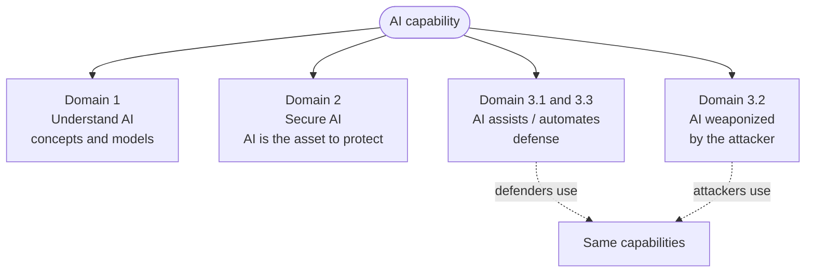
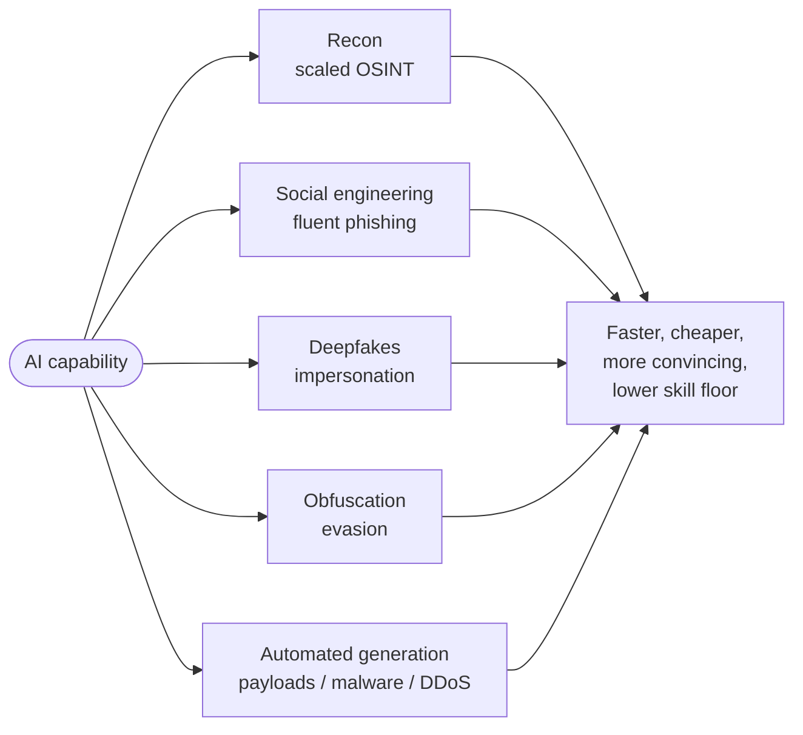

Unofficial study material aligned to CompTIA SecAI+ CY0-001 V1 objectives — verify against the official objectives. See ../exam-objectives.md.

# Domain 3.0 — AI-assisted Security (24%)

> ⚠️ **UNOFFICIAL / COMMUNITY-MAINTAINED.** Not affiliated with or endorsed by CompTIA. Reconcile against the official CY0-001 V1 objectives before exam day.

---

## What this domain is about

Keep the three "AI + security" domains mentally separate — the exam will try to blur them:

- **Domain 1** — *understanding AI* (concepts, models, training, prompting).
- **Domain 2** — *securing AI* (protecting models, data, gateways, access against attacks on the AI itself).
- **Domain 3 (this one)** — *using AI to do security work*. AI is now the **tool in the analyst's hands**, and — in 3.2 — the **tool in the attacker's hands**. AI is the *subject doing the work*, not the *object being protected*.

This domain has three objectives:

| Obj | Framing | Core question |
|---|---|---|
| **3.1** | AI as the **defender's assistant** | Which AI-enabled tool fits this security task, and what's the catch? |
| **3.2** | AI as the **attacker's force multiplier** | How does AI make an existing attack vector cheaper, faster, or more convincing? |
| **3.3** | AI as the **automation engine** | Which security workflows can AI run end-to-end, and where must a human stay in the loop? |

The single sentence to carry into the exam: **the same AI capability is a defender's tool (3.1/3.3), an attacker's tool (3.2), and — separately — an asset that must be secured (Domain 2).** Misreading which chair the question sits in is the most common way to pick a plausible-but-wrong answer.

Two themes decide most questions in this domain:

1. **Every AI assist carries a paired risk.** Hallucinated findings, false positives/negatives, and **data leakage to the tool/provider** are the recurring exam answers. AI is a productivity multiplier for the analyst, not a replacement for analyst judgment — it changes *how fast* the work gets done, not *who is accountable* for it. If an option says "AI fully replaces the analyst," it is wrong.
2. **Human-in-the-loop is non-negotiable for consequential actions.** AI *recommends*; humans *approve* anything that changes production, closes an incident, or blocks a user — until guardrails and validation are proven.

> 🎯 **Exam tip — three domains, one acronym.** When a question mentions "AI" and "security," first decide which domain it lives in: *securing AI* (2.x) vs *AI assisting security* (3.x) vs *AI as an attack tool* (3.2). The same word — "prompt injection," "agent," "guardrail" — means different things depending on which side of the tool you're on.

---

## 3.1 — Given a scenario, use AI-enabled tools to facilitate security tasks

The objective splits into **tools/applications** (the *form factor* AI shows up in) and **use cases** (the *security task* it accelerates). Scenario questions usually give you a task and ask which tool/form factor fits — or give you a tool and ask what its risk is.

How to read a 3.1 scenario:

1. **Identify the task** — is the analyst writing detection rules, triaging a vuln scan, reading foreign-language intel, summarizing a report? That maps to a **use case**.
2. **Identify the constraint** — sensitive data? offline/air-gapped? needs to *act* on a system? That picks the **form factor** (private chatbot vs MCP-connected agent vs IDE plug-in).
3. **Name the catch** — every option carries a paired risk; the best answer is the one whose risk you can *control* (redaction, human review, least privilege), not the one that pretends there is no risk.

### Tools / applications (the delivery form factors)

| Tool / application | What it is | Security use | Key risk / limitation |
|---|---|---|---|
| **IDE plug-ins** | AI assistant embedded in the code editor (autocomplete, chat, fix suggestions) | Secure-coding hints, inline vuln flags, fixing flagged code, writing tests | Suggests insecure or licensed code; **source code is sent to the provider** (IP/data leakage); over-trust of generated fixes |
| **Browser plug-ins** | AI in the browser to summarize/analyze the current page | Summarize threat-intel articles, advisories, long reports; explain a page | Page content (possibly sensitive/internal) leaves to the AI service; prompt injection from **malicious page content** the plug-in ingests |
| **CLI plug-ins** | AI in the terminal/shell that suggests or explains commands | Generate/explain `grep`, `jq`, PowerShell, packet-capture filters; draft scripts | Suggested commands may be destructive or wrong; pasting logs/secrets into the prompt leaks them |
| **Chatbots** | General conversational LLM interface (web/app) | Explain a CVE, draft a policy, brainstorm a threat model, translate an alert | **Hallucinated facts/CVEs**; no awareness of your environment unless you paste data in (leakage); training-data cutoff |
| **Personal assistants** | Task-oriented agentic assistant tied to your accounts/calendar/email | Triage security email, schedule, draft responses, look things up | Broad account access = large blast radius; can act on **injected instructions** in email/docs; over-permissioned |
| **MCP (Model Context Protocol) server** | A standard server interface that lets an AI assistant **call external tools and read external data sources** through a defined protocol | Connects the assistant to your SIEM, ticketing, vuln scanner, code repo, knowledge base so it can *act*, not just chat | Each MCP server is a **new trust boundary and supply-chain dependency**; an untrusted/compromised server can exfiltrate data, return poisoned context, or expose over-broad tools. Scope tools, authenticate, and least-privilege them |

#### MCP, specifically (high-yield)

**MCP (Model Context Protocol)** is an open standard that gives AI assistants a uniform way to discover and call **external tools** and pull in **external data/context** — think of it as a "USB-C port" between the model and the rest of your stack. Instead of one-off integrations, the assistant talks to one or more **MCP servers**, each of which exposes *tools* (actions it can invoke) and *resources* (data it can read).

Security considerations the exam cares about:

- **MCP servers are trust boundaries and supply-chain components.** A malicious or compromised server can leak everything the assistant sends it, or feed back **poisoned/indirect-injection content** that hijacks the agent.
- **Tool permissions must be least-privilege and scoped.** An MCP server wired to "run any shell command" or "read all of the ticketing system" is excessive agency waiting to be abused.
- **Authenticate and authorize the connection** (the assistant ↔ server link), and **log every tool call** for audit. Treat tool output as **untrusted input**, not ground truth.
- This connects directly to Domain 2 (insecure plug-in design, excessive agency, manipulating application integrations) — MCP is *how* an assistant gets the agency that Domain 2 warns you to control.

Reading the form factors as a spectrum helps on the exam:

- **Read-only assistants** (chatbot, browser plug-in, IDE chat) only *advise* — their worst case is bad advice or **data leakage**, not unauthorized action.
- **Action-capable form factors** (personal assistant, MCP server, agents in 3.3) can *do things* — their worst case adds **excessive agency, hijack via injection, and a large blast radius**. The more an AI tool can *act*, the more Domain 2 controls (least privilege, scoping, logging) you must wrap around it.

> 🎯 **Exam tip — advise vs act.** If a 3.1 question hinges on whether a tool changed something or just suggested it, the risk profile changes completely. "Summarize this advisory" (read-only → leakage risk) is a different answer than "let the assistant patch the host" (action → excessive-agency risk).

### Use cases (the security tasks AI accelerates)

For each: **how AI helps** and the **risk/limitation** to control for.

| Use case | How AI helps | Risk / limitation |
|---|---|---|
| **Signature matching** | Generates and tunes detection signatures (YARA, Sigma, Snort) from samples; explains what a signature catches | Brittle to obfuscation/variants; AI may write an **overly broad signature** → false-positive flood, or miss novel variants |
| **Code quality & linting** | Flags smells, style, and likely bugs; explains lint findings; suggests fixes | **False positives** and missed real defects; "fixes" can introduce new bugs; not a substitute for SAST/secure review |
| **Vulnerability analysis** | Summarizes scanner output, prioritizes by exploitability, maps to CVE/CWE, explains a finding | **Hallucinated CVEs / fabricated severity**; may miss context (compensating controls); needs human validation before action |
| **Automated penetration testing** | Suggests attack paths, generates test payloads, chains recon → exploit, drafts the report | Can cause **real damage / scope creep**; hallucinated "successful" exploits; legal/authorization risk; still needs an expert to validate findings |
| **Anomaly detection** | ML baselines normal behavior (network, user, auth) and flags deviations | **Alert fatigue** from false positives; **concept drift** as "normal" changes; explainability gap — why was this flagged? |
| **Pattern recognition** | Correlates IOCs, clusters related alerts, spots campaign patterns across noisy data | May surface **spurious correlations**; bias from training data; analyst still owns the "so what?" |
| **Incident management** | Drafts timelines, summarizes alert storms, suggests next steps, writes the incident summary | Wrong/over-confident triage; **hallucinated root cause**; must not auto-close or auto-contain without human sign-off |
| **Threat modeling** | Generates STRIDE/attack-tree first drafts, enumerates threats for an architecture, proposes mitigations | Generic/boilerplate output; **misses business context** and novel threats; a starting point, not the finished model |
| **Fraud detection** | Models transaction/behavior patterns to score fraud risk in near-real-time | False positives block legit users; **bias/fairness** issues; adversaries adapt (fraud-GAN cat-and-mouse); needs explainability for disputes |
| **Translation** | Translates foreign-language threat intel, phishing lures, dark-web chatter, malware strings | **Mistranslation of nuance/slang/idiom**; loss of technical meaning; sensitive text sent to the translation service |
| **Summarization** | Condenses long advisories, log dumps, reports, and policies into briefings | **Omits the one critical detail**; introduces inaccuracies; reader trusts the summary without reading the source |

> 🎯 **Exam tip — benefit vs risk is always paired.** For any 3.1 tool/use case, the right answer names a *concrete* limitation: **false positives** (anomaly/linting/fraud), **hallucinated findings** (vuln analysis, CVEs, exploits), or **data leakage to the tool** (IDE sends your source code, browser plug-in sends the page, chatbot gets pasted logs). If an answer says the AI tool is "accurate and complete on its own," eliminate it.

> 🎯 **Exam tip — data leakage is the quiet risk.** IDE, browser, CLI, and chatbot assistants frequently send your content to a third-party model. For sensitive code/logs/PII, the control is a **private/self-hosted model, data minimization, redaction before submission, and a sanctioned-tool policy** (ties to Domain 4 shadow AI).

#### Group the use cases by their dominant failure mode

It's easier to remember 11 use cases if you cluster them by *which* risk dominates — that's usually what the answer choices test:

- **Detection tasks → false positives / false negatives.** Signature matching, anomaly detection, pattern recognition, fraud detection. AI casts a wide net; the cost is **alert fatigue** and **missed novel attacks**, plus **concept drift** as "normal" shifts. Control = tuning, feedback loops, and explainability.
- **Analysis/advice tasks → hallucination.** Vulnerability analysis, threat modeling, automated pen testing, incident management. AI sounds confident and may **invent CVEs, exploits, or root causes**. Control = validate against an authoritative source and have an expert own the conclusion.
- **Language tasks → lost fidelity + leakage.** Translation, summarization, code quality/linting. The danger is the **one dropped detail** or **mistranslated nuance**, plus sending sensitive text to the tool. Control = review the source, use a private model for sensitive content.

This mirrors the classic detection trade-off: tune for fewer false negatives and you get more false positives, and vice-versa. AI shifts the curve but does not abolish it — a question implying "AI eliminates both false positives and false negatives" is wrong.

---

## 3.2 — Explain how AI enables or enhances attack vectors

Same capabilities, opposite chair. AI doesn't usually invent brand-new attacks — it makes **existing attack vectors cheaper, faster, more scalable, and more convincing**, and lowers the skill floor so less-skilled actors can run sophisticated operations. Know each vector, *how AI weaponizes it*, and the *defensive implication*.

### AI-generated content / deepfakes

AI synthesizes realistic **fake media** — audio, video, images, text — for:

- **Impersonation** — clone a CEO's voice for a fraudulent wire request (vishing), face-swap video for fake KYC or video calls, spoof an executive in a meeting.
- **Misinformation** — false content spread *without intent to deceive* (still harmful).
- **Disinformation** — false content **deliberately crafted to deceive** — influence operations, fake breach announcements to move markets, fabricated "leaks."

The exam-critical shift: **deepfakes collapse the assumption that seeing or hearing someone proves identity.** Voice cloning needs only seconds of reference audio (often scraped from earnings calls, podcasts, or voicemail), and real-time face-swap can defeat video-based identity checks. This turns classic business email compromise (BEC) into **multi-channel** fraud — a phishing email *backed by* a confirming "phone call from the boss."

**Defensive implication:** out-of-band verification (call back on a known number, code words for payment changes), liveness/anti-spoof checks, deepfake detection (imperfect and an arms race), **content provenance/watermarking (C2PA)**, and user awareness that "I saw/heard it" is no longer proof. The durable control is **process** (independent verification of high-value requests), not detection. *Deepfake-enabled BEC is a top exam scenario.*

### Adversarial networks (GANs)

A **generative adversarial network (GAN)** pits a **generator** (creates fakes) against a **discriminator** (tries to detect fakes); they train against each other until the generator's output is realistic. Offensively, GANs:

- produce **deepfakes** and synthetic identities/biometrics,
- generate **adversarial examples / evasive malware** that slips past ML detectors,
- mutate samples until a classifier is fooled (the discriminator role models the defender's detector).

> ⚠️ **Accuracy note.** A GAN is the *generator-vs-discriminator architecture*, distinct from "adversarial examples" (perturbed inputs that fool a model). The exam may use "adversarial networks" loosely; remember the **two-network, competing-objective** design. (Cross-reference Domain 1.1.)

The elegant irony for the exam: the **discriminator** half of a GAN is essentially a detector. Defenders run the same loop in reverse — **adversarial training** feeds AI-generated fakes/evasive samples into their own detectors to harden them. The attacker's generator and the defender's detector are locked in the same competitive dynamic.

**Defensive implication:** adversarial training (train detectors on AI-generated samples), ensemble/behavioral detection rather than single signatures, and continuous robustness testing as the generator improves.

### Reconnaissance

AI **automates and scales OSINT**: scrapes and correlates public data, social media, breach dumps, code repos, and certificate transparency to profile targets, map org charts, and find attack surface — in minutes instead of days. Crucially, recon **feeds the next stage**: the personal details it harvests become the personalization in the phishing lure, and the exposed services it finds become the targets for automated payload generation.

**Defensive implication:** minimize public exposure, monitor your external attack surface, scrub employee data from public profiles where feasible, and assume attackers already hold a complete, AI-assembled profile of your org and people.

### Social engineering (AI-crafted phishing)

AI writes **fluent, personalized, error-free phishing** at scale — no more telltale grammar mistakes. It tailors lures to the target (role, recent activity, writing style harvested in the recon step), localizes across languages, and powers **conversational** phishing/chatbots that respond in real time to keep a victim engaged. Combined with deepfakes → multi-channel BEC (email + voice). The same techniques scale **spear-phishing** to the whole org: every recipient gets a bespoke lure, not one mass template.

**Defensive implication:** "look for bad grammar" advice is obsolete. Lean on **technical controls** (DMARC/SPF/DKIM, link rewriting, MFA-phishing-resistant FIDO2), behavioral analytics, and verification-culture training. (Cross-reference Domain 3.1 fraud/anomaly detection on the defense side.)

### Obfuscation

AI helps attackers **hide malicious intent**: rewrite/polymorph malware to evade signatures, generate many functionally-equivalent payload variants, obfuscate scripts, and craft prompts that **evade content filters / guardrails** (jailbreak phrasing). Also used to obfuscate C2 traffic patterns.

Two flavors matter for the exam: (1) **obfuscating malware/traffic** to defeat *your* detection, and (2) **obfuscating prompts** to defeat *guardrails on AI systems* (jailbreak phrasing, encoding, role-play framing) — the offensive twin of Domain 2 jailbreaking.

**Defensive implication:** behavior-based and ML detection over static signatures; sandboxing/detonation for files; and **guardrail hardening plus prompt-firewall input inspection** on your own AI systems (ties to Domain 2.2).

### Automated data correlation

AI **fuses fragmented data** — combining breach dumps, public records, and stolen partial data — to **re-identify individuals**, link pseudonymous accounts, and assemble dossiers for targeted fraud or extortion. Defeats naive anonymization.

**Defensive implication:** strong de-identification (differential privacy, k-anonymity), data minimization, and assume that "anonymized" + auxiliary data can be re-identified at scale.

### Automated attack generation

AI generates offensive artifacts end-to-end:

- **Attack vector discovery** — analyze a target/codebase to find exploitable weaknesses and viable paths.
- **Payloads** — generate exploit code, injection strings, and evasive variants on demand.
- **Malware** — draft, refine, and mutate malicious code, including **polymorphic** strains; lower skill floor for malware authors.
- **Honeypot** — *both sides*: attackers use AI to **detect and evade** honeypots; defenders use AI to **build more convincing** honeypots/decoys.
- **DDoS (distributed denial of service)** — orchestrate and adapt botnet traffic, optimize attack patterns to evade mitigation, and (against AI systems) drive **model-DoS** via expensive queries.

The compounding danger is **chaining**: an attacker can use one AI workflow to discover the vector, generate a tailored payload, mutate it past detection, and adapt in response to defenses — at machine speed, with little human effort. That collapses the time between *target identified* and *target exploited*, shrinking the defender's window.

**Defensive implication:** assume faster, more numerous, more adaptive attacks. Respond with **AI-assisted defense** (3.1/3.3), faster patch cycles, automated containment for reversible actions, and rate/cost controls. The arms race is symmetric — the same class of model writes the exploit and the detection — so the defender's edge comes from **layered controls, tempo, and process**, not from any single detector.

> 🎯 **Exam tip — AI is a force multiplier, not a new weapon.** For 3.2, the correct framing is almost always "AI makes [existing attack] **faster / cheaper / more convincing / more scalable** and lowers the skill floor" — not "AI created an attack that was previously impossible." Watch for the **symmetry**: GANs, honeypots, and malware analysis all cut both ways (attacker and defender use the same tech).

### Defensive implications, consolidated

For 3.2 the exam often pairs an **attacker use** with the **best defense**. Memorize the pairings:

| Attacker use of AI | Best defense |
|---|---|
| Deepfake voice/video impersonation (BEC, fake KYC) | **Out-of-band verification**, code words, liveness checks, **content provenance/watermarking (C2PA)**, awareness |
| GAN-generated evasive malware / adversarial examples | Adversarial training, behavioral/ensemble detection, robustness testing |
| AI-scaled reconnaissance / OSINT | Attack-surface minimization & monitoring; assume a complete target profile exists |
| AI-crafted, error-free phishing | DMARC/SPF/DKIM, link rewriting, **phishing-resistant MFA (FIDO2)**, verification culture (grammar tips are dead) |
| Obfuscation / guardrail-evading prompts | Behavior-based detection, sandbox detonation, guardrail hardening on your own AI |
| Automated re-identification via data correlation | Differential privacy / k-anonymity, data minimization, assume "anonymized" can be re-linked |
| Automated payload/malware/DDoS generation | AI-assisted defense (3.1/3.3), faster patching, rate/cost limits, model-DoS protections |

The strategic takeaway the blueprint wants: **the defender's answer to AI-powered offense is AI-powered defense plus stronger technical controls** — you cannot out-spot AI phishing by eye, so you raise the floor with cryptographic and behavioral controls and use your own AI tooling (3.1) to keep pace with attacker tempo.

> 🎯 **Exam tip — the symmetry is the point.** GANs (generator vs discriminator), honeypots (attacker evades vs defender builds), and malware analysis (write vs detect) all describe the *same arms race from both chairs*. When a question gives you one side, the distractor is often the other side of the very same technique.

---

## 3.3 — Given a scenario, use AI to automate security tasks

3.1 was AI *assisting* a human task. 3.3 is AI *running* the task — partial or full automation of security workflows — with the constant caveat: **automate the toil, gate the consequence.** Over-automation (auto-closing incidents, auto-deploying unreviewed code, agents acting without limits) is the failure mode the exam tests.

Think of automation as a **ladder of autonomy**, and notice where the human-approval gate sits:

1. **Assist** — AI drafts/suggests; human does everything (this is 3.1).
2. **Augment** — AI executes low-risk steps automatically (enrichment, triage drafts); human reviews output.
3. **Supervised autonomy** — AI runs the whole workflow but **pauses at an approval gate** before any consequential/irreversible action.
4. **Full autonomy** — AI acts end-to-end with no human gate. Acceptable **only** for low-risk, reversible toil with strong guardrails, logging, and a kill switch.

The exam's "right" altitude is almost always **rung 2 or 3**: automate the toil, keep a human gate on consequence. Jumping a high-impact action to rung 4 is the classic wrong answer.

> 🎯 **Exam tip — 3.1 vs 3.3.** They overlap, so disambiguate by *who does the work*. **3.1 = AI assists a human** doing a security task (the human still acts). **3.3 = AI runs the task** as automation (AI acts, human supervises/approves). "Help me write a YARA rule" is 3.1; "automatically generate and deploy detection rules through the pipeline" is 3.3. Same model, different altitude of autonomy.

### Scripting tools (low-code / no-code)

AI generates automation **scripts and playbooks** from natural-language intent: SOAR playbooks, parsing/enrichment scripts, IaC, API glue. **Low-code** = minimal coding with AI assistance; **no-code** = describe the workflow in plain language and the platform builds it — democratizing automation for non-developers.

The democratization is the double edge: the same accessibility that lets a junior analyst stand up a playbook in minutes also lets unreviewed, over-permissioned automation proliferate outside change control.

- **Helps:** non-experts build automations fast; analysts skip boilerplate.
- **Risk:** generated scripts may be **insecure, wrong, or destructive**; no-code hides logic from review; **shadow automation** sprawl (a 3.3 cousin of shadow AI). *Control:* review and test before production; least-privilege service accounts; version control; keep generated automations in the same governance pipeline as hand-written code.

### Document synthesis and summarization

Auto-generate and condense security docs: incident reports, exec briefings, policies, compliance evidence, post-mortems; summarize alert storms and long log dumps into a readable narrative.

- **Helps:** huge time savings on reporting; consistent formatting; faster exec/regulator communication.
- **Risk:** **hallucinated details** in an official report; omission of a critical fact; sensitive content sent to the tool. Because these documents become the record of record, an invented detail can mislead decisions long after. *Control:* human review/sign-off on anything that goes to leadership, regulators, or customers, and a private model for sensitive evidence.

### Incident response ticket management

AI **triages, enriches, categorizes, prioritizes, and routes** IR tickets; deduplicates and correlates related alerts into a single case; drafts the summary and suggested actions; auto-populates fields.

This is one of the highest-value, lowest-risk automations in the SOC: most of it is **reversible toil** (enrichment, deduplication, drafting) that AI can own outright, with the human reserving judgment for the consequential decisions.

- **Helps:** cuts MTTA/MTTR, reduces queue noise, consistent triage, frees analysts for investigation.
- **Risk:** **mis-prioritization** (a critical buried as low), wrong auto-routing, premature auto-close. *Control:* human confirmation before closing or before any containment action; keep an audit trail of AI-suggested vs human-approved actions.

### Change management

AI assists the change pipeline:

- **AI-assisted approvals** — analyze a change request for risk, completeness, conflicts, and policy compliance; recommend approve/reject and flag risky changes for human review.
- **Automated deployment / rollback** — push approved changes through a pipeline and **auto-roll-back on failure/anomaly** (failed health check, error spike, security regression).

The key distinction: **automated rollback on a failed health check is good automation** (reversible, fast, contains blast radius), but **automated approval of the change itself** is where over-trust bites — an AI approver that nobody overrides becomes a rubber stamp with authority it shouldn't hold.

- **Helps:** faster, more consistent change review; fast blast-radius containment via rollback.
- **Risk:** **rubber-stamping** by an over-trusted AI approver; bad auto-deploy; rollback that itself causes an outage. *Control:* AI **recommends**, human **approves** material/high-risk changes; tested rollback path; separation of duties so the AI does not both propose and approve.

### AI agents (autonomous security workflows)

**AI agents** plan and execute **multi-step** workflows autonomously — chaining tools (often via MCP, 3.1) to investigate, decide, and act: an autonomous SOC tier-1 that pulls context, queries the SIEM, enriches IOCs, and proposes/takes containment.

An AI agent differs from the assistants in 3.1 by **planning and acting over multiple steps toward a goal** rather than answering a single prompt — it decides *which* tools to call and *in what order*, which is exactly what makes it powerful and dangerous.

- **Helps:** 24/7 autonomous handling of routine workflows; scales the SOC.
- **Risk:** **excessive agency** — an agent that can act has a large blast radius; cascading errors; prompt-injection-driven hijack; **opacity** of multi-step reasoning. *Control — guardrails are mandatory:*
  - **least-privilege, scoped tools** (only what the workflow needs),
  - **human-in-the-loop approval gates** for consequential/irreversible actions (containment, blocking, deletion),
  - **bounded autonomy** (rate/scope limits, kill switch),
  - **full logging and observability** of every step and tool call,
  - **sandboxing** and segregated identities per agent.
  - (Cross-reference Domain 2: excessive agency, insecure plug-in design, manipulating application integrations.)

### CI/CD (continuous integration / continuous deployment)

AI embeds security automation across the pipeline — the practical home of "shift-left," where security checks run automatically on every commit instead of as a late-stage gate. Note the new addition the AI era brings: **model testing**, which extends unit/regression testing to the ML artifacts themselves (accuracy, drift, bias, and security regressions such as a newly-jailbreakable model). For a SecAI+ pipeline, *the model is part of the build* and gets the same automated quality and security gates as code.

| Stage | AI assist | Watch-out |
|---|---|---|
| **Code scanning** | AI-augmented SAST/secret detection; triage/prioritize/explain findings, suppress false positives | Hallucinated or missed findings; don't auto-suppress real bugs |
| **Software composition analysis (SCA)** | Flag vulnerable/abandoned/malicious dependencies and license issues; suggest safe upgrades | Stale CVE data; transitive deps missed; verify before bulk-bumping |
| **Unit testing** | Generate unit tests and edge cases from code/spec | Tests assert wrong/incomplete behavior; coverage ≠ correctness |
| **Regression testing** | Generate/select regression tests; spot what a change might break | Flaky/false signals; can't catch what it wasn't told to check |
| **Model testing** | Test ML models for accuracy, drift, bias, robustness, and **security regressions (jailbreaks)** before deploy — the ML analog of unit/regression tests | Eval gaps; benign-looking metrics hiding a security regression |
| **Automated deployment / rollback** | Gate deploys on security checks; auto-roll-back on failed checks or runtime anomalies | A bad gate blocks good code or passes bad code; test the rollback path |

- **Helps:** "shift-left" security at machine speed; consistent gates on every commit.
- **Risk:** **over-automation** — a green pipeline becomes false assurance; AI gates can be wrong in both directions. *Control:* treat AI output as **advisory plus a deterministic backstop**; require human review for high-risk merges/releases; keep the pipeline's own credentials least-privilege.

> 🎯 **Exam tip — automate toil, gate consequence.** The right 3.3 answer keeps a **human-in-the-loop for consequential, irreversible, or high-risk actions** (closing incidents, approving risky changes, containment, production deploys) while fully automating low-risk, reversible toil (enrichment, drafting, triage, test generation). "Let the agent auto-contain/auto-close/auto-deploy with no review" is the wrong answer.

> 🎯 **Exam tip — where human-in-the-loop is mandatory.** Memorize these gates: **incident closure**, **change approval for material changes**, **containment/blocking actions**, **production deployment of unreviewed code**, and **anything sent to regulators/leadership/customers**. Reversible + low-risk → automate. Irreversible or high-impact → human approves.

---

## Master table — Security task → how AI assists → key risk / control

One-stop review across all three objectives. Read it as: *the assist is real, but never free* — every row pairs a benefit with the control that keeps the risk in check.

| Security task | How AI assists | Key risk | Control |
|---|---|---|---|
| Signature matching | Generates/tunes YARA/Sigma/Snort rules | Brittle to variants; over-broad → FP flood | Human review; behavioral backstop |
| Code quality & linting | Flags smells, suggests fixes | False positives; bad fixes | Pair with SAST; review fixes |
| Vulnerability analysis | Summarizes/prioritizes findings | Hallucinated CVEs / severity | Validate against authoritative source |
| Automated pen testing | Suggests paths, generates payloads | Real damage; fabricated "success" | Scope/authorization; expert validates |
| Anomaly detection | ML baselines + flags deviations | Alert fatigue; concept drift | Tuning; feedback loop; explainability |
| Incident management | Triage, timeline, summary, next steps | Wrong triage; premature close | Human confirms close/containment |
| Threat modeling | Drafts STRIDE/attack trees | Generic; misses context | Expert refines with business context |
| Fraud detection | Real-time risk scoring | FPs block users; bias | Explainability; human dispute review |
| Translation / summarization | Condenses/translates intel & reports | Lost nuance; omitted detail; leakage | Source review; private model for sensitive data |
| IR ticket management (3.3) | Triage/enrich/route/dedupe | Mis-prioritization; auto-close | Human sign-off; audit trail |
| Change approvals (3.3) | Risk-scores change requests | Rubber-stamping | AI recommends, human approves |
| Auto deploy/rollback (3.3) | Gates + auto-rollback on anomaly | Bad gate/deploy | Tested rollback; SoD; human gate for high-risk |
| AI agents (3.3) | Autonomous multi-step workflows | Excessive agency; hijack | Least-privilege tools; approval gates; kill switch; logging |
| CI/CD scanning & SCA (3.3) | SAST/SCA augmentation in pipeline | Missed/hallucinated findings | Deterministic backstop; human review on high-risk |
| **Attacker use (3.2)** | Phishing, deepfakes, recon, malware | Faster/cheaper/convincing attacks | DMARC/MFA, out-of-band verify, provenance, AI-assisted defense |

---

## Worked scenarios (think like a PBQ)

These mirror the scenario style of 3.1 and 3.3. Read the situation, decide the form factor/altitude, then name the control.

**Scenario A — sensitive triage.** A SOC analyst wants AI help reviewing authentication logs that contain usernames and source IPs. The org has no sanctioned AI tool yet.
*Reasoning:* the task is **summarization/anomaly review** (use case); the constraint is **sensitive data + no sanctioned tool** = shadow-AI and **data-leakage** exposure. Pasting logs into a public chatbot leaks PII to a third party.
*Answer:* route to a **private/self-hosted model** (or redact/minimize before submission) under a **sanctioned-tool policy**; do not use an unsanctioned public chatbot. (3.1 + Domain 4 shadow AI.)

**Scenario B — connecting the assistant to the SIEM.** Leadership wants the AI assistant to query the SIEM and ticketing system directly so it can investigate alerts.
*Reasoning:* "directly query/act on external systems" = an **MCP server / agent** form factor — action-capable, so Domain 2 risks apply.
*Answer:* stand up an **MCP server with least-privilege, scoped tools** (read-only where possible), **authenticate** the connection, **log every tool call**, and treat returned context as **untrusted**. Add a human gate before any containment action. (3.1 MCP + 3.3 agents.)

**Scenario C — the green pipeline.** A team proposes auto-merging any pull request that passes the AI SAST gate, with no human review, to "move faster."
*Reasoning:* AI scanning has **false negatives**; a green build is not proof. Auto-merge of unreviewed code is a **consequential** action.
*Answer:* keep AI scanning as **advisory plus a deterministic SAST/SCA backstop**, and require **human review for high-risk merges**. Automate the *toil* (running scans, drafting findings), gate the *consequence* (the merge). (3.3 CI/CD, rung 2–3 autonomy.)

**Scenario D — the urgent wire request.** The CFO's "voice" calls the treasury team requesting an immediate wire to a new account; it sounds exactly right.
*Reasoning:* AI **deepfake voice impersonation** powering BEC. "It sounds like them" is no longer proof.
*Answer:* **out-of-band verification** — call back on a known-good number and use a pre-agreed **payment-change code word**; never act on voice/video identity alone. (3.2 deepfakes.)

---

## Common exam traps (quick hits)

- **"AI eliminates false positives."** No — detection tools trade FPs against FNs; AI shifts the curve, never abolishes it.
- **"Let the agent auto-contain / auto-close / auto-deploy."** Wrong for consequential or irreversible actions — those need a human gate.
- **"The gateway/scanner alone makes it secure."** No single control is the answer; layer advisory AI with a deterministic backstop.
- **"AI invented a brand-new attack."** Usually a force-multiplier story: faster/cheaper/more convincing/lower skill floor.
- **"Spot the phishing by its grammar."** Obsolete — AI writes clean, localized lures; rely on technical controls and verification.
- **"An MCP server is just a plug-in, no big deal."** It's a **trust boundary + supply-chain dependency** with action capability — scope, authenticate, and log it.

---

## Check yourself

**Q1.** An analyst pastes a chunk of internal source code into a public chatbot to ask for a vulnerability review. Name the *form factor* and the *primary risk*.
**A1.** Form factor: a **chatbot** (could also be an IDE plug-in if embedded). Primary risk: **data leakage to the tool/provider** — proprietary code leaves the org to a third-party model. Secondary: **hallucinated findings**. Control: sanctioned **private/self-hosted model**, data minimization/redaction, shadow-AI policy (Domain 4).

**Q2.** What is an MCP server, and why is each one a security concern?
**A2.** An **MCP (Model Context Protocol) server** exposes external **tools and data/resources** to an AI assistant through a standard protocol so the assistant can *act*, not just chat. Each is a **new trust boundary and supply-chain dependency**: a malicious/compromised server can **exfiltrate** data, return **poisoned context** (indirect injection), or grant **excessive agency**. Controls: authenticate the connection, least-privilege/scoped tools, log every call, treat tool output as untrusted.

**Q3.** True/false: AI lets attackers create entirely new categories of attack that were previously impossible.
**A3.** **Mostly false.** AI is primarily a **force multiplier** — it makes existing vectors (phishing, recon, malware, DDoS) **faster, cheaper, more convincing, more scalable**, and **lowers the skill floor**. The novelty is in scale/quality, not a brand-new attack class.

**Q4.** A GAN is being used offensively. Describe its architecture and one offensive use.
**A4.** A **GAN** pairs a **generator** (creates fakes) against a **discriminator** (detects fakes); they train competitively until output looks real. Offensive uses: **deepfakes**, synthetic identities/biometrics, or **evasive/adversarial malware** that fools an ML detector. Defense: adversarial training and behavioral/ensemble detection.

**Q5.** Which of these should an autonomous SOC agent be allowed to do without human approval: (a) enrich an alert with threat-intel context, (b) isolate a production host from the network, (c) close an incident as a false positive? Justify.
**A5.** Only **(a)** — enrichment is **low-risk and reversible**, safe to automate. **(b)** containment and **(c)** incident closure are **consequential/irreversible** → require a **human-in-the-loop approval gate**. General rule: automate toil, gate consequence; constrain agents with least-privilege tools, bounded autonomy, logging, and a kill switch.

**Q6.** In a CI/CD pipeline, AI-augmented SAST reports a green build. Why is that not sufficient assurance, and what's the control?
**A6.** AI scanners produce **false negatives (missed real bugs)** and **false positives/auto-suppressions**, so a green build can be **false assurance**. Control: treat AI findings as **advisory plus a deterministic backstop** (traditional SAST/SCA, policy gates), require **human review for high-risk merges/releases**, and keep pipeline credentials **least-privilege**. The over-automation trap is mistaking "the AI gate passed" for "the code is secure."

---

## Key terms recap (high-yield definitions)

| Term | One-line definition |
|---|---|
| **MCP (Model Context Protocol)** | Open standard letting an AI assistant call external **tools** and read external **data/resources** via MCP **servers** — turns chat into action; each server is a trust boundary |
| **IDE / browser / CLI plug-in** | AI embedded in the editor / browser / terminal; convenient but routes your code/page/log content to the provider |
| **Chatbot vs personal assistant** | Chatbot = conversational, read-only advice; personal assistant = task-oriented and **action-capable** with account access |
| **Deepfake** | AI-synthesized fake audio/video/image used for **impersonation, misinformation, disinformation** |
| **Misinformation vs disinformation** | Both false; **disinformation is deliberate** deception, misinformation is spread without intent |
| **GAN** | **Generator vs discriminator** trained competitively to produce realistic fakes / evasive samples |
| **Obfuscation** | Hiding malicious intent — polymorphic malware, payload variants, guardrail-evading prompts |
| **Automated data correlation** | Fusing fragmented data to **re-identify** people / link accounts at scale |
| **AI agent** | Autonomous multi-step workflow executor; powerful but risks **excessive agency** without guardrails |
| **Human-in-the-loop** | A mandatory human approval gate before consequential/irreversible AI-driven actions |
| **Automate toil, gate consequence** | The governing rule of 3.3: fully automate low-risk reversible work; require human approval for high-impact actions |

## Cross-references

- [`domain-1-ai-concepts.md`](domain-1-ai-concepts.md) — GANs, transformers, LLMs/SLMs, prompting, and human-centric design (human-in-the-loop) that underpin every tool in 3.1/3.3.
- [`domain-2-securing-ai-systems.md`](domain-2-securing-ai-systems.md) — the *other side*: securing the AI you deploy. Excessive agency, insecure plug-in design, prompt injection, and manipulating application integrations all bound how far you can trust 3.1 MCP servers and 3.3 agents.
- [`domain-4-governance-risk-compliance.md`](domain-4-governance-risk-compliance.md) — sanctioned vs unsanctioned tools, **shadow AI**, data-leakage governance, and accountability for AI-assisted decisions.
- [`../practice-tests/`](../practice-tests/) — Domain 3 carries ~14 of 60 exam items (24%); drill scenario-to-tool and human-in-the-loop questions.

This domain rewards a reflex more than memorization: for any "AI + security" item, place it in the right chair, weigh the paired benefit and risk, and find the human-in-the-loop gate. Do that consistently and the 24% is yours.

> 🎯 **Final exam tip — one decision tree for Domain 3.** First ask *which chair*: defender assisting (3.1), defender automating (3.3), or attacker weaponizing (3.2). Then ask *advise or act*: read-only tools risk **leakage and hallucination**; action-capable tools/agents/MCP add **excessive agency**. Then ask *who approves the consequence*: reversible toil automates, irreversible/high-impact actions need **human-in-the-loop**. Three questions resolve most items in this domain.

> ⚠️ **Reminder:** unofficial study aid. Verify all tool/use-case scoping against the current CompTIA CY0-001 V1 objectives.
