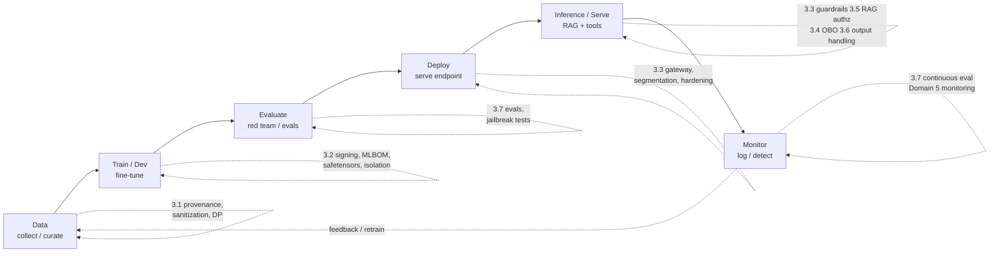

# Domain 3.0 — Securing the AI/ML Lifecycle (22%)

> ⚠️ **UNOFFICIAL / COMMUNITY-MAINTAINED** study guide for the hypothetical "CompTIA SecAI+" exam. Not affiliated with or endorsed by CompTIA. Reconcile against the official objectives. See [`../exam-objectives.md`](../exam-objectives.md).

---

## What this domain is about

Domain 2 taught you the **attacks**. Domain 3 is the **defense**: the controls, where they sit in the lifecycle, and which threat each one stops. The exam framing for this domain is almost always **"given attack X, which control best mitigates it?"** — so study every control as the answer to a specific Domain 2 threat.

This is a *controls* domain. Expect performance-based questions (PBQs) that drag-and-drop a control onto a lifecycle stage, or single-best-answer items where three options are real controls but only one targets the named attack.

Two themes run through every objective and decide most questions:

1. **Trust boundaries.** The user, the model, retrieved content, tool output, and the application backend are *separate trust zones*. The control you want is usually the one that enforces the boundary the attack crosses — e.g., "model output is untrusted" puts a validation boundary between the model and your backend.
2. **Layering over silver bullets.** Input filters are bypassable, prompts aren't a security boundary, and any single guardrail fails eventually. Correct answers assume *defense in depth*: a control plus a backstop plus monitoring.

### Objectives covered

| Obj | Focus | Core idea |
|---|---|---|
| **3.1** | Secure **data** | Provenance, sanitization, poisoning defenses, differential privacy, PII minimization |
| **3.2** | Secure **training & development** | Secure MLOps, model signing, MLBOM, safetensors over pickle |
| **3.3** | Secure **deployment & inference** | AI gateway, guardrails, rate limiting, sandboxing, least privilege |
| **3.4** | **Identity & access** for AI | Per-agent identity, OBO, tool allow-listing, RBAC/ABAC, key hygiene |
| **3.5** | Secure **RAG & knowledge systems** | Vector DB security, document-level authz, indirect-injection defenses |
| **3.6** | **Guardrails & defensive controls** | Output validation/encoding, PII redaction, human-in-the-loop |
| **3.7** | **Test & evaluate** AI security | Red teaming, jailbreak testing, evals, regression in CI/CD |

### Where each control class applies in the lifecycle

> 🎯 **Exam tip — defense in depth.** No single control is "the answer" to securing an LLM app. The blueprint expects layered controls: a poisoned answer that slips past input filtering should still be caught by output validation, least-privilege tool scoping, and monitoring. If an option says "the gateway alone makes it secure," it's wrong.

---

## 3.1 — Secure data

Data is the supply chain's first link. If the data is poisoned, mislabeled, or carries unmanaged PII, no downstream control fully recovers. These controls map to **Domain 2.1 data poisoning / backdoors**, **2.5 PII leakage / memorization**, and the OWASP **LLM04 Data and Model Poisoning**.

| Control | Why | How | Mitigates (Domain 2) |
|---|---|---|---|
| **Provenance & lineage** | Know where every datum came from and how it was transformed | Track dataset sources, hashes, transformations; record in a data catalog / lineage graph | Poisoning (2.1), supply-chain (2.3) |
| **Data validation & sanitization** | Reject malformed, anomalous, or adversarial samples before they reach training | Schema checks, outlier/anomaly detection, label auditing, deduplication | Poisoning, backdoor triggers (2.1) |
| **Data classification** | Apply controls proportional to sensitivity | Tag datasets (public/internal/confidential/regulated); drive access + retention | PII leakage (2.5) |
| **PII handling & minimization** | Don't ingest what you don't need; you can't leak what you never stored | Collect minimally, redact/tokenize/pseudonymize PII before training | Memorization & regurgitation (2.5) |
| **Differential privacy (DP)** | Mathematically bound how much any single record influences the model | Add calibrated noise during training (DP-SGD); track a privacy budget (ε) | Membership inference (2.1), training-data extraction (2.5) |
| **Dataset access control** | Limit who can read/modify training data | RBAC/ABAC on data stores; separate read vs curate vs approve roles | Insider poisoning (2.1) |

**Poisoning defenses in depth:** vet sources (trusted, signed datasets), validate/clean inputs, use anomaly detection on samples and gradients, and — critically — keep a **clean, versioned dataset** so you can retrain after a poisoning incident (ties to Domain 5.4 resilience).

**Provenance vs lineage — know the distinction.** *Provenance* is the **origin** of data (who produced it, from where, under what license/consent). *Lineage* is the **journey** — every transformation, join, filter, and label applied between source and training set. You need both: provenance tells you whether to trust the source; lineage lets you trace a poisoned or PII-laden record back through the pipeline and surgically remove its influence. Record both in a data catalog, and hash datasets at each stage so tampering is detectable.

**Securing the data stage end to end:**

| Stage | Risk if unmanaged | Control |
|---|---|---|
| **Collection** | Scraped/untrusted sources carry poison or PII | Source allow-listing, consent/licensing checks, provenance capture |
| **Storage** | Unauthorized read/modify of training data | Encryption at rest, RBAC/ABAC, immutable/versioned buckets |
| **Curation / labeling** | Malicious or sloppy labels create backdoors | Label auditing, multi-reviewer approval, anomaly detection |
| **Transformation** | Silent tampering between source and train | Lineage tracking, per-stage hashing, reproducible jobs |
| **Retention / disposal** | Over-retention of PII expands leak surface | Minimization, retention limits, secure deletion, right-to-erasure support |

> 🎯 **Exam tip — minimization beats redaction.** The strongest PII control is **not collecting it** in the first place (data minimization). You cannot regurgitate, re-identify, or leak data the model never ingested. Redaction/tokenization is the fallback when you *must* process sensitive fields.

**Privacy-enhancing techniques (PETs) at a glance** — the exam may contrast them, so keep them distinct:

| Technique | What it does | Best against |
|---|---|---|
| **Differential privacy** | Adds calibrated noise so no single record measurably changes the model | Membership inference, memorization/extraction |
| **Data minimization** | Don't collect/retain what you don't need | All downstream PII leakage |
| **Pseudonymization / tokenization** | Replace identifiers with reversible tokens (keys held separately) | Re-identification while preserving utility |
| **Anonymization / aggregation** | Irreversibly strip identifiers; report only aggregates | Re-identification |
| **Federated learning** | Train across data that never leaves its source | Centralizing raw sensitive data |

> 🎯 **Exam tip.** **Differential privacy** is the specific answer to **membership inference** and **training-data memorization**, because it limits any single record's influence on the model. If a question asks how to stop an attacker from proving a record was in the training set, the answer is DP — not "encryption" and not "access control."

---

## 3.2 — Secure training & development

This is the **MLOps/LLMOps** hardening objective and the supply-chain defense for **Domain 2.3** (poisoned pretrained models, unsafe deserialization, registry compromise, typosquatting).

| Control | Why | How |
|---|---|---|
| **Environment isolation** | Contain a compromised training job; protect data and weights | Segregated networks, dedicated compute, no prod credentials in dev, ephemeral runners |
| **Secrets management** | Keys/tokens leak from notebooks, env files, and pipelines | Vault/secrets manager, short-lived creds, no secrets in code or model artifacts |
| **Reproducibility** | Detect tampering and enable rollback | Pin data/code/hyperparameter versions; deterministic builds; record run metadata |
| **Model signing / integrity** | Prove a model artifact is authentic and unmodified | Cryptographically sign weights; verify signature before load/deploy |
| **MLBOM / SBOM** | Inventory every component (data, base models, libs) for supply-chain visibility | Generate a Machine-Learning Bill of Materials; track licenses + provenance |
| **Dependency & model scanning** | Catch malicious packages and unsafe model files before they run | Scan PyPI deps; scan model files for embedded code / pickle opcodes |
| **Safe serialization** | Prevent arbitrary code execution on model load | Prefer **safetensors**; avoid **pickle**-based formats from untrusted sources |

### safetensors vs pickle

| | **pickle** (.pkl, default `torch.save`) | **safetensors** |
|---|---|---|
| Loads code on deserialize? | **Yes** — `__reduce__` can run arbitrary code | **No** — pure tensor data, no code paths |
| Risk | **RCE** when loading an untrusted model | Drastically reduced attack surface |
| Exam stance | Treated as **unsafe deserialization** (Domain 2.3) | The recommended safe format |

> 🎯 **Exam tip — safetensors over pickle.** Loading a pickle-serialized model from an untrusted hub is **arbitrary code execution**, full stop. The mitigation is: download only from trusted/signed sources, scan the artifact, and use **safetensors**. "Just antivirus the file" is a distractor.

> 🎯 **Exam tip — signing + MLBOM.** When a scenario describes a **typosquatted model** or a **compromised model registry**, the controls are **model signing/integrity verification** plus an **MLBOM** for provenance — the supply-chain analogues of code signing and an SBOM.

### Securing the MLOps/LLMOps pipeline

The training pipeline is software, so it inherits software supply-chain risk *plus* data/model risk. Apply DevSecOps to it:

- **Separation of duties & gated promotion** — code, data, and model changes flow through review and approval before reaching the **model registry** and production. No one person can push a model to prod unreviewed.
- **Harden the model registry** — authenticate writers, sign artifacts on publish, verify signatures on pull, and log every promotion. A compromised registry is a one-stop supply-chain attack (Domain 2.3).
- **Pin and scan dependencies** — lock library versions, pull from trusted internal mirrors, and scan for typosquats and known CVEs. Treat a malicious `pip`/`conda` package the same as a malicious model.
- **Protect build secrets** — pipeline runners must use short-lived, scoped credentials; never bake API keys into images or weights.
- **Provenance attestation** — generate build provenance (e.g., SLSA-style attestations) so you can prove *which* code + data produced *which* model artifact.

> 🎯 **Exam tip — the model registry is the crown jewels.** Pretend it's an internal package repository. The controls are the same: authenticated/authorized publishing, **signed artifacts**, signature verification on consumption, and an audit trail. "Anyone on the team can overwrite a production model tag" is a finding, not a feature.

---

## 3.3 — Secure deployment & inference

This is where most LLM-app controls live. It maps to **Domain 2.2 (prompt injection, insecure output handling, unbounded consumption)** and **2.4 (excessive agency)**.

### The AI gateway

An **AI gateway** is a reverse-proxy / control plane that sits between clients and model endpoints. It is the central enforcement point for inference-time controls:

- **Authentication & authorization** of callers, and routing to models
- **Input and output guardrails** (content filtering, PII detection, injection detection)
- **Rate limiting & quotas** per user/key/tenant
- **Logging, observability, and cost tracking** (feeds Domain 5)
- **Centralized policy** so controls aren't reimplemented per app

| Control | Why | Mitigates (Domain 2 / OWASP) |
|---|---|---|
| **Input guardrails** | Filter prompts before they reach the model | Prompt injection, jailbreaks (LLM01) |
| **Output guardrails** | Filter/validate model responses before they reach users or systems | Insecure output handling (LLM05), sensitive disclosure (LLM02) |
| **Content filtering / moderation** | Block toxic, unsafe, policy-violating content | Harmful output, jailbreaks |
| **Rate limiting & quotas** | Bound requests, tokens, and cost per principal | **Unbounded consumption / model DoS / cost harvesting (LLM10)** |
| **Sandboxing / isolation** | Contain code execution and tool calls | Excessive agency (LLM06), agent SSRF (2.4) |
| **Least privilege** | Endpoint and its service account get only required permissions | Lateral movement, confused-deputy (2.4) |
| **Endpoint hardening** | Reduce the serving attack surface | Inference-server attacks (2.3) |
| **Network segmentation** | Isolate model-serving and vector DBs from general network | Lateral movement, exfiltration |

**Content filtering & moderation** sits at both ends. Modern stacks run a *layered classifier* approach: a moderation model/service screens **inputs** (block disallowed requests, detect injection) and **outputs** (block toxic, illegal, self-harm, or policy-violating responses) before either crosses the boundary. The classifier verdict can **block, redact, or route to a human** (HITL). Crucially, moderation is **policy-driven and tunable** — different tenants/use-cases get different thresholds — and it is logged so Domain 5 detection can spot abuse trends.

> 🎯 **Exam tip — unbounded consumption.** The control for **LLM10 Unbounded Consumption** (model DoS, "cost bombing," wallet-draining via huge prompts/outputs) is **rate limiting + quotas + token/output caps + timeouts** — not "buy more GPUs." Watch for cost-control and abuse-of-resources scenarios pointing here. Per-user/per-key quotas also let you contain a single abusive principal without degrading everyone.

> 🎯 **Exam tip — input vs output controls.** Input guardrails reduce *injection reaching the model*; output guardrails reduce *bad/dangerous content leaving the model*. You need **both** — input filtering is bypassable, so output handling is the backstop (see 3.6).

### Sandboxing, isolation, and egress control

Agentic and code-executing LLM apps must assume the model *will* eventually be steered into doing something harmful. Containment limits the damage:

- **Code-execution sandboxing** — run any model-generated or tool-executed code in an isolated, ephemeral sandbox (container/microVM) with no standing credentials and a strict resource ceiling.
- **Egress filtering / SSRF defense** — restrict outbound network from the model/agent to an allow-list of destinations. This is the direct control for **agent-driven SSRF and lateral movement (Domain 2.4)** — a tool tricked into fetching `http://169.254.169.254/` (cloud metadata) should hit a deny wall.
- **Network segmentation** — place model-serving, vector DBs, and tool servers in segmented zones so a foothold in one doesn't reach the rest of the estate.
- **Endpoint hardening** — patch the inference server, disable unused features/ports, authenticate every call, and never expose a raw inference endpoint (e.g., an unauthenticated model server) to the internet.

> 🎯 **Exam tip — SSRF via agents.** If an agent with a "fetch URL" or "browse" tool can be pointed at internal services or cloud metadata, the control is **egress allow-listing + network segmentation + least-privilege tool scoping** — *not* "tell the model not to access internal IPs." Prompt-level instructions are not a security boundary.

---

## 3.4 — Identity & access control for AI

Agents act on behalf of users and call tools/APIs. Without proper identity, an agent becomes a **confused deputy** with broad standing permissions. Maps to **Domain 2.4 (agentic risks)** and OWASP **LLM06 Excessive Agency**.

| Pattern | What it means | Why it matters |
|---|---|---|
| **Per-agent identity** | Each agent/service has its own distinct identity (not a shared admin key) | Attribution, scoping, and revocation are per-agent |
| **On-behalf-of (OBO)** | Agent calls downstream resources **using the requesting user's delegated authority**, not its own god-mode token | Downstream systems enforce *the user's* permissions; prevents privilege escalation through the agent |
| **Tool allow-listing** | Agent may only invoke an explicit, approved set of tools/functions | Limits blast radius; blocks tool misuse |
| **Least privilege** | Each identity gets the minimum scopes needed, nothing standing | Caps damage from a hijacked agent |
| **RBAC / ABAC** | Role- or attribute-based authorization on models, tools, and data | Consistent, auditable access decisions |
| **API-key & token hygiene** | Short-lived, scoped, rotated credentials in a vault | Stops key leakage → reuse |
| **Scoped model/tool permissions** | Bind permissions to specific operations and resources | Prevents over-broad agency |

**RBAC vs ABAC for AI** — both appear as answer choices:

- **RBAC (role-based)** — permissions attach to roles (analyst, admin, agent-X). Simple, coarse, easy to audit. Good for "which agents may call which tool classes."
- **ABAC (attribute-based)** — decisions use attributes of the user, resource, and context (department, data classification, time, tenant). Finer-grained — well suited to **RAG document-level authorization**, where access depends on the *document's* sensitivity and the *user's* clearance, not just a role.

> 🎯 **Exam tip — OBO vs service identity.** When an agent retrieves data or calls an API **for a specific user**, it should use **on-behalf-of (OBO)** delegation so the downstream system applies *that user's* authorization. A single high-privilege service account that ignores the end-user's permissions is the classic **confused-deputy** setup — and the wrong answer.

> 🎯 **Exam tip — tool allow-listing + least privilege.** The two-word answer to **excessive agency (LLM06)** is "**least privilege**," operationalized as **tool allow-listing**, scoped permissions, and (for high-impact actions) **human-in-the-loop**. Reducing the *number of tools, permissions, and autonomy* an agent has is the core mitigation.

### Key & token hygiene, and MCP/tool-server access

Credentials are the highest-value loot in an AI system because one leaked key can unlock models, tools, and data:

- **Short-lived, scoped tokens** — prefer minted, narrowly-scoped, expiring tokens over long-lived static API keys. Scope each to specific models/tools/operations.
- **Centralized secrets management** — store keys in a vault, inject at runtime, rotate on a schedule and on suspected compromise, and **never** embed keys in prompts, system prompts, code, or model artifacts.
- **Per-tenant / per-user key isolation** — so abuse or revocation is contained to one principal (also enables per-key rate limits and cost attribution).
- **Secure MCP / tool servers** — authenticate the agent to each tool server, authorize per operation, and **allow-list which tool servers an agent may connect to**. A rogue or spoofed MCP server is a classic **2.4 tool-server abuse** vector; pin and verify the servers you trust.

> 🎯 **Exam tip — excessive agency has three knobs.** OWASP frames excessive-agency mitigation as reducing **excessive functionality** (fewer tools), **excessive permissions** (least privilege/OBO), and **excessive autonomy** (human-in-the-loop for impactful actions). If an answer only addresses one knob while the scenario screams another, it's a distractor.

---

## 3.5 — Secure RAG & knowledge systems

RAG expands the trust boundary to include the **vector database**, the **retrieved documents**, and their **sources**. Maps to **Domain 2.5 (RAG data leakage / broken document-level authz, embedding inversion)**, **2.2 (indirect prompt injection)**, and OWASP **LLM08 Vector and Embedding Weaknesses**.

### RAG authorization patterns

The cardinal rule: **retrieval must respect the requesting user's permissions.** A vector search that returns any chunk regardless of who's asking is a data-leak waiting to happen.

| Pattern | How it works | Trade-off |
|---|---|---|
| **Query-time filtering (document-level authz)** | Attach the user's permissions/ACLs as metadata filters on the vector query so only authorized chunks are retrieved | Requires accurate, current ACL metadata on every chunk |
| **Pre-retrieval partitioning** | Separate indexes/namespaces per tenant or sensitivity level; route the query to the allowed index | Strong isolation; more indexes to manage |
| **Post-retrieval authorization check** | Re-verify the user can access each retrieved document before passing it to the model | Defense-in-depth backstop; adds latency |
| **Inherit source ACLs** | Sync permissions from the system of record (e.g., SharePoint/Drive) into the index and keep them fresh | Only as good as sync freshness |

> 🎯 **Exam tip — document-level authorization.** The #1 RAG control is **document-level authorization at retrieval time**: the index must enforce *the asking user's* access rights, not just "is this user logged in." A user retrieving another user's confidential doc through chat is **broken document-level authz (2.5)** — fix it at the retrieval layer, not by asking the model to "please not reveal it."

### Other RAG controls

| Control | Why | Mitigates |
|---|---|---|
| **Vector DB security** | The index holds sensitive embeddings/text | Authn/authz, encryption, network isolation (LLM08) |
| **Source vetting / trust** | Untrusted sources can carry injected instructions or false facts | Indirect prompt injection (2.2), index poisoning |
| **Indirect-prompt-injection defenses** | Retrieved content is **data, not instructions** | See below (LLM01) |
| **Embedding security** | Embeddings can be inverted to recover source text | Embedding inversion (2.5) — restrict access to vectors |
| **Data freshness / index integrity** | Stale or tampered chunks mislead answers | Index poisoning, retrieval of revoked content |

### Indirect-prompt-injection defenses (retrieved/tool content)

Indirect injection hides instructions inside content the model later reads (a web page, a doc, an email). Defenses layer:

- **Treat retrieved content as untrusted data**, never as system instructions — delimit/quote it, and instruct the model that retrieved text cannot change its policy.
- **Injection detection/classifiers** on retrieved chunks before they enter the prompt.
- **Strip/neutralize** active content (HTML/markdown/links) and known instruction patterns.
- **Provenance/source labeling** so the model and guardrails know what came from where.
- **Least privilege + human-in-the-loop** so even a successful injection can't trigger high-impact tool calls unattended.

> 🎯 **Exam tip — content is data, not commands.** The conceptual fix for **indirect prompt injection** is to keep a hard boundary: **retrieved/tool-returned text is untrusted data**, not trusted instructions. There is no single perfect filter, so combine input classification, prompt isolation, and least-privilege tool scoping.

### Embedding & index security (LLM08)

Embeddings are not "anonymized" — they can be **inverted** to approximately reconstruct the source text (Domain 2.5 embedding inversion). Treat the vector store like the sensitive corpus it represents:

- **Access-control the vectors** themselves (authn/authz on the vector DB), not just the chat UI.
- **Encrypt** embeddings at rest and in transit; isolate the vector DB on a segmented network.
- **Carry ACL metadata on every chunk** so retrieval filtering (3.5 patterns) actually has something to enforce against.
- **Validate and re-index on source changes** — when a source document's permissions change or it's deleted/revoked, the index must update or you'll serve stale, unauthorized content.
- **Vet and sign trusted sources** before ingestion to prevent **index poisoning** (an attacker planting a malicious doc that gets retrieved and injected later).

> 🎯 **Exam tip — embeddings ≈ the data.** "We only store embeddings, so there's no PII exposure" is **false**. Embeddings are invertible; protect the vector DB with the same rigor as the underlying confidential text.

---

## 3.6 — Guardrails & defensive controls

Guardrails are the runtime policy layer around the model. The single most testable principle here: **treat model output as untrusted.**

### Guardrail types

| Type | Sits at | Examples |
|---|---|---|
| **Input guardrails** | Before the model | Injection/jailbreak detection, allow/deny lists, PII detection, topic/scope limits, prompt templating |
| **Output guardrails** | After the model | Output validation/**encoding**, PII redaction, content moderation, schema/format enforcement, grounding/citation checks |
| **Action guardrails** | Before a tool/effect | Tool allow-listing, **human-in-the-loop** approval, transaction limits, dry-run/confirmation |

### Input vs output controls

| | **Input controls** | **Output controls** |
|---|---|---|
| Goal | Stop bad prompts reaching the model | Stop bad/dangerous output leaving the model |
| Examples | Prompt hardening/templating, injection detection, allow/deny lists, rate limiting | **Output encoding/validation**, PII redaction, moderation, schema validation |
| Mitigates | LLM01 prompt injection, LLM10 abuse | **LLM05 improper output handling**, LLM02 sensitive disclosure |
| Key caveat | Bypassable — not sufficient alone | The backstop when input filtering fails |

### Improper output handling — the marquee control

**Improper/insecure output handling (OWASP LLM05)** occurs when an application trusts model output and passes it unsanitized into a downstream interpreter — a browser (→ XSS), a shell (→ command injection), SQL (→ SQLi), or a file path. The model is effectively an untrusted user supplying input to your backend.

- **Output encoding** — context-aware encode model text before rendering (HTML-encode for browsers, etc.).
- **Output validation** — enforce expected schema/type/range; reject or sanitize anything else.
- **Parameterize / sandbox** — never concatenate model output into SQL or shell; use parameterized queries and sandboxed execution.
- **Least privilege on the consumer** — the component acting on output runs with minimal rights.

### Prompt hardening — and its limits

Prompt-level defenses raise the bar but are **not a security boundary** on their own:

- **Templating & role separation** — keep a fixed system prompt; clearly delimit and label user vs retrieved vs tool content so the model treats them differently.
- **Instruction defenses** — explicitly tell the model that retrieved/user content cannot override policy, and to refuse instruction-like text inside data.
- **Spotlighting / encoding** — mark untrusted content (delimiters, tagging) so it's visibly "data," and the model (and downstream classifiers) can tell.

Because a determined attacker can usually craft a bypass, prompt hardening must be **backed by** input classifiers, output validation, least privilege, and HITL. On the exam, "we fixed it by improving the system prompt" is rarely the *complete* answer.

### Canary tokens & other defensive controls

| Control | Purpose | Mitigates |
|---|---|---|
| **PII redaction** | Remove/mask sensitive data in prompts and outputs | Sensitive disclosure (2.2/2.5) |
| **Canary tokens / honeytokens** | Plant a unique secret in the system prompt or a doc; an alert fires if it ever appears in output or external traffic | Detects **system-prompt leakage** and **data exfil** (Domain 5.2) |
| **Prompt-injection detection** | Classify malicious instructions in inputs/retrieved content | LLM01 |
| **Allow / deny lists** | Constrain topics, domains, commands, URLs | Injection, SSRF (2.4) |
| **Grounding / citation checks** | Require answers to be supported by retrieved sources | Hallucination, overreliance (2.2) |
| **Human-in-the-loop (HITL)** | Require human approval before high-impact actions | Excessive agency (LLM06), autonomous-action abuse (2.4) |

> 🎯 **Exam tip — model output is untrusted.** This is the single highest-yield idea in Domain 3. The fix for **LLM05 improper output handling** is **output encoding + validation + parameterization** at the *consuming* component — exactly like you'd treat user input. If a chatbot's reply is rendered as raw HTML and pops an alert box, that's XSS via the model, and the fix is output encoding.

> 🎯 **Exam tip — human-in-the-loop.** For **high-impact or irreversible actions** (sending money, deleting data, emailing customers, executing code), the expected control is **human-in-the-loop approval**, paired with least privilege and tool allow-listing. Full autonomy on high-impact actions is the wrong answer.

---

## 3.7 — Test & evaluate AI security

You can't secure what you don't test. This objective is the assurance layer and feeds back into the lifecycle (and into Domain 5 monitoring).

| Activity | What it is | Targets |
|---|---|---|
| **AI red teaming** | Adversaries (human/automated) probe the system for failures and policy bypasses | Jailbreaks, injection, harmful output, data leakage |
| **Adversarial / jailbreak testing** | Curated and generated attack prompts run against the model/app | LLM01, LLM02, jailbreak resistance |
| **Automated evals & benchmarks** | Repeatable, scored tests of safety/security behaviors | Regression detection across versions |
| **Model validation** | Verify performance, robustness, and safety before release | Evasion robustness, fairness, accuracy |
| **Regression testing for safety** | Ensure a new model/prompt didn't reintroduce a fixed vulnerability | Safety regressions |
| **Continuous evaluation in CI/CD** | Gate deployments on eval/red-team results; re-run on every change | Drift, supply-chain changes, prompt edits |

> 🎯 **Exam tip — red teaming vs evals.** **Red teaming** is adversarial, exploratory ("can we break it?"). **Evals** are repeatable, scored, automatable ("did this build regress?"). Mature programs do both and **wire evals into CI/CD** so model/prompt changes can't silently reintroduce a jailbreak. Red teaming finds new issues; evals stop them coming back.

> 🎯 **Exam tip.** Security testing for AI is **continuous**, not one-and-done. Models, prompts, tools, and retrieved data change constantly, so safety/security must be **re-evaluated on every change** and monitored in production (Domain 5).

### What to test, and the CI/CD gate

A useful eval/red-team suite for an LLM app covers, at minimum:

| Dimension | Example test | Maps to |
|---|---|---|
| **Prompt-injection resistance** | Known + generated injection prompts, direct and indirect | LLM01 / 2.2 |
| **Jailbreak resistance** | Role-play, encoding, multi-turn jailbreak attempts | LLM01 / 2.2 |
| **Output safety** | Toxic, illegal, or policy-violating output checks | LLM05 / moderation |
| **Sensitive-data leakage** | Probes for PII, secrets, system-prompt extraction | LLM02 / 2.5 |
| **Tool/agency abuse** | Attempts to trigger unauthorized or high-impact tool calls | LLM06 / 2.4 |
| **RAG authorization** | Cross-user retrieval attempts against the index | 2.5 broken authz |
| **Robustness** | Adversarial/evasion inputs for ML classifiers | 2.1 evasion |

**Model validation & robustness** complements adversarial testing: before release, validate accuracy/performance on held-out data, **robustness** to adversarial/perturbed inputs (Domain 2.1 evasion), calibration, and fairness/bias metrics (Domain 4.4). Capture the results in a **model card / system card** (Domain 4.2) so reviewers and auditors can see what was tested and where the limits are.

**The CI/CD gate:** treat these as a test suite with thresholds. A model/prompt/tool change that drops below the safety bar **fails the build** and is blocked from promotion — the same discipline as unit tests gating code. This closes the loop back to the lifecycle: evals at the **Evaluate** stage, continuous evals on every redeploy, and production monitoring (Domain 5) feeding new attack cases back into the suite.

> 🎯 **Exam tip — humans vs automation.** **Red teaming** needs human creativity to find *novel* bypasses; **automated evals** provide *scale and regression coverage*. The expected mature answer pairs both and treats the eval suite as a **deployment gate**, not a post-release nicety.

---

## Defense-in-depth for an LLM app (summary)

Map each layer to the threats it absorbs. In an exam PBQ, this table is the mental model for "which layer stops attack X?"

| Layer | Representative controls | Primary threats mitigated (Domain 2 / OWASP) |
|---|---|---|
| **Gateway / edge** | AuthN/AuthZ, **rate limiting & quotas**, routing, central logging | Unbounded consumption / DoS (LLM10), abuse |
| **Prompt / input** | Prompt templating/hardening, **injection & jailbreak detection**, allow/deny lists, PII detection | Prompt injection (LLM01), system-prompt leak |
| **Retrieval (RAG)** | **Document-level authorization**, vector-DB security, source vetting, indirect-injection defenses | RAG data leakage / broken authz (2.5), LLM08, indirect injection |
| **Output / handling** | **Output encoding & validation**, schema enforcement, PII redaction, moderation, grounding checks | Improper output handling (LLM05), sensitive disclosure (LLM02) |
| **Identity / action** | **Per-agent identity & OBO**, **tool allow-listing**, least privilege, **human-in-the-loop**, sandboxing | Excessive agency (LLM06), confused-deputy / agent SSRF (2.4) |
| **Monitoring / assurance** | Prompt/response & **tool-call logging**, anomaly & injection detection, **continuous evals**, canary tokens | Detection & response (Domain 5), regression (3.7) |

> 🎯 **Exam tip — match the layer to the attack.** Improper output handling → **output layer** (encode/validate). RAG leakage → **retrieval layer** (document authz). Cost bombing → **gateway** (rate limit/quota). Rogue tool call → **identity/action layer** (allow-list + OBO + HITL). The layer that *owns* the trust boundary the attack crosses is the answer.

### Quick attack → control reference

The fastest way to answer "which control stops attack X?" — memorize this map.

| Attack (Domain 2 / OWASP) | First-line control(s) | Objective |
|---|---|---|
| Direct prompt injection / jailbreak (LLM01) | Input guardrails + injection detection + prompt hardening | 3.3 / 3.6 |
| **Indirect** prompt injection (LLM01) | Treat retrieved content as data + classifiers + least-privilege tools | 3.5 / 3.6 |
| Sensitive info disclosure (LLM02) | PII redaction, output filtering, canary tokens, minimization | 3.1 / 3.6 |
| Improper output handling (LLM05) | **Output encoding/validation + parameterization** | 3.6 |
| Excessive agency (LLM06) | Tool allow-listing, least privilege, OBO, **HITL** | 3.4 / 3.6 |
| Vector/embedding weaknesses (LLM08) | Vector-DB authz, encryption, document-level authz | 3.5 |
| Unbounded consumption (LLM10) | **Rate limiting + quotas + token/output caps + timeouts** | 3.3 |
| Data/model poisoning (2.1 / LLM04) | Provenance, sanitization, anomaly detection, clean versioned data | 3.1 |
| Membership inference / memorization (2.1/2.5) | **Differential privacy**, minimization | 3.1 |
| Unsafe deserialization / poisoned model (2.3) | **safetensors**, signing, scanning, trusted sources, MLBOM | 3.2 |
| Agent SSRF / lateral movement (2.4) | Egress allow-listing, segmentation, sandboxing | 3.3 / 3.4 |
| Broken RAG document authz (2.5) | **Retrieval-time document-level authorization** | 3.5 |

---

## ✅ Check yourself

1. **A chatbot's reply is rendered straight into a web page and triggers a JavaScript alert. Which OWASP risk and which control?**
   → **LLM05 Improper Output Handling**; treat model output as untrusted and apply **context-aware output encoding/validation** before rendering.

2. **An attacker sends millions of huge prompts to drive up your inference bill. Best control?**
   → **Rate limiting and quotas** (plus token/output caps and timeouts) at the **AI gateway** — the answer to **LLM10 Unbounded Consumption**, not adding capacity.

3. **In RAG, a user receives a confidential document they shouldn't see. Root cause and fix?**
   → **Broken document-level authorization**; enforce **retrieval-time authorization** so the vector search only returns chunks the *requesting user* is permitted to see.

4. **You must load a third-party model from an unknown hub. What format/practice reduces risk and why?**
   → Use **safetensors** (no code execution on load) instead of **pickle** (arbitrary code execution / unsafe deserialization); also verify a **signature** and scan the artifact.

5. **An agent calls downstream APIs for a specific user. What identity pattern prevents privilege escalation?**
   → **On-behalf-of (OBO)** delegation so downstream systems enforce *the user's* permissions — paired with **per-agent identity**, **tool allow-listing**, and **least privilege**.

6. **Difference between AI red teaming and evals, and where do evals belong?**
   → **Red teaming** is adversarial discovery of new weaknesses; **evals** are repeatable, scored regression tests. Wire **evals into CI/CD** so changes can't silently reintroduce fixed vulnerabilities.

---

## Who owns which control (shared responsibility)

Domain 3 controls don't all live with you. Map them to the **shared responsibility model** (Domain 1.5) so you pick the control *you can actually enforce*:

| Control area | SaaS/hosted LLM (you = deployer) | Self-hosted/open model (you = operator) |
|---|---|---|
| Base-model safety/alignment | Provider | **You** (selection, fine-tune, eval) |
| Model serialization/format safety | Provider | **You** (safetensors, scanning) |
| Gateway, guardrails, rate limits | **You** (app side) | **You** |
| RAG document-level authz | **You** | **You** |
| Identity/OBO, tool allow-listing | **You** | **You** |
| Infra/host hardening, GPU isolation | Provider | **You** |
| Evals & red teaming of *your* app | **You** | **You** |

> 🎯 **Exam tip — controls follow ownership.** With a hosted API you can't sign the base model's weights, but you **own** the gateway, guardrails, RAG authz, identity, and output handling. With a self-hosted model, supply-chain controls (signing, safetensors, scanning, MLBOM) shift onto **you**. Match the recommended control to who controls that layer.

---

## Cross-references

- **Attacks these controls stop:** [`./domain-2-threats-attacks.md`](./domain-2-threats-attacks.md) — every control here answers a Domain 2 threat (poisoning 2.1, injection/output/consumption 2.2, supply chain 2.3, agentic 2.4, data/RAG 2.5).
- **Foundations (AI gateway, RAG, agents, MCP):** [`./domain-1-foundations.md`](./domain-1-foundations.md)
- **Governance wrapper (NIST AI RMF, ISO 42001, model cards, AUP):** [`./domain-4-governance-risk-compliance.md`](./domain-4-governance-risk-compliance.md)
- **Run-time operations (logging, detection, IR, resilience):** [`./domain-5-secops-incident-response.md`](./domain-5-secops-incident-response.md)
- **Frameworks & ID crosswalk:** [`./frameworks-crosswalk.md`](./frameworks-crosswalk.md) · **Glossary:** [`./glossary.md`](./glossary.md) · **Acronyms:** [`./acronyms.md`](./acronyms.md)
- **Blueprint & objective numbering:** [`../exam-objectives.md`](../exam-objectives.md)

> ⚠️ Reminder: community-authored study aid. Where it differs from the official CompTIA SecAI+ objectives, the official document wins.
