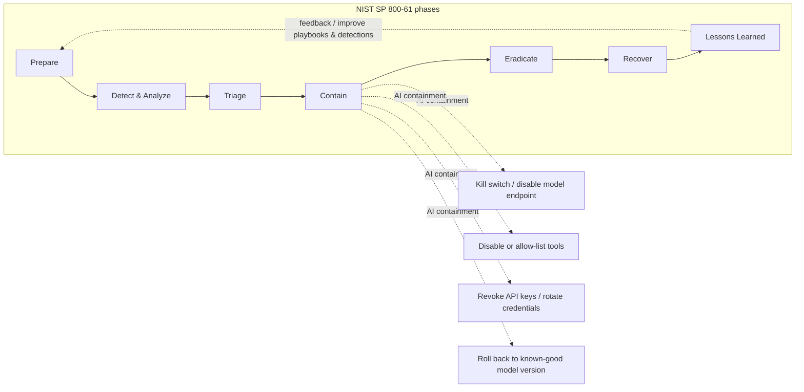
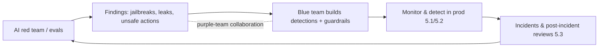

# Domain 5.0 — AI Security Operations & Incident Response (20%)

> ⚠️ **UNOFFICIAL / COMMUNITY STUDY GUIDE.** Not affiliated with, endorsed by, or sourced from CompTIA. Reconcile against the official objectives before exam day. See [`../exam-objectives.md`](../exam-objectives.md) for the full blueprint and disclaimer.

---

## What this domain is about

Domain 5 is where everything else in SecAI+ becomes operational. The earlier domains teach you the threats (Domain 2), how to build securely (Domain 3), and how to govern (Domain 4). Domain 5 asks the day-2 question: **once an AI system is live in production, how do you watch it, catch attacks against it, respond when something goes wrong, keep it running, and get better over time?**

The big mental shift for the exam: a traditional SOC monitors hosts, networks, and identities. An **AI-aware SOC** still does all of that, but adds a new telemetry layer — **prompts, model responses, tool/function calls, agent actions, token consumption, and model/version metadata** — and a new class of detections (prompt injection, jailbreaks, data exfiltration via outputs, unbounded consumption). The incident-response lifecycle does **not** get reinvented; it stays anchored to **NIST SP 800-61** but gains AI-specific containment moves (disable a tool, revoke an API key, **roll the model back to a known-good version**, hit a kill switch).

At 20%, this is the second-heaviest domain. Expect performance-based questions (PBQs) that hand you a log snippet or an incident and ask you to pick the right containment action or the right thing to log.

Three threads run through every objective in this domain and are worth holding in your head as you read:

1. **The lifecycle never changes — only the contents.** NIST SP 800-61's four phases (and NIST AI RMF's *Manage* function) still govern; AI just supplies new telemetry, new detections, and new containment verbs.
2. **Preparation buys you containment.** Every fast AI response — kill switch, key revocation, tool disable, model rollback — only works if it was built and versioned *before* the incident. 5.1, 5.3-Prepare, and 5.4 reinforce each other constantly.
3. **It's a loop, not a line.** What you learn detecting and responding (5.2/5.3) feeds vulnerability management and purple teaming (5.5), which feeds new detections and guardrails. The exam rewards seeing AI security operations as continuous.

### Objectives covered

- **5.1** Monitor and log AI systems: prompt/response and tool-call logging, observability/telemetry, audit trails, drift and performance monitoring, cost/usage monitoring, privacy-aware logging.
- **5.2** Detect AI threats: anomaly detection, prompt-injection and jailbreak detection, abuse/misuse detection, detection engineering and SIEM integration, ATLAS-mapped detections, canaries/honeytokens.
- **5.3** Respond to AI incidents: AI-aware IR lifecycle, containment (disable model/tool, revoke keys, kill switch), model rollback, jailbreak/prompt-injection response, data-leak and PII-exposure response, playbooks and comms.
- **5.4** Ensure AI resilience and recovery: model versioning/rollback, backups of models/indexes/configs, failover and graceful degradation, defense against DoS / unbounded consumption / cost bombing, business continuity for AI services.
- **5.5** Manage vulnerabilities and continuous improvement: AI vulnerability management and disclosure, patching/updating models and dependencies, threat intelligence for AI, post-incident reviews, purple teaming and feedback loops.

---

## 5.1 — Monitor and log AI systems

You cannot detect, respond to, or investigate what you never recorded. Logging is the foundation of the entire domain, and it is the single most testable idea in 5.1: **if it isn't logged, it didn't happen** as far as the SOC is concerned.

### What to log for an LLM / agentic application

A traditional web-app log captures requests, responses, status codes, and identities. An LLM application needs all of that **plus** an AI-specific telemetry layer. For each interaction, capture:

- **Identity & session** — authenticated user/service identity, agent identity (for agentic systems, each agent or tool-server should have its own identity), session ID, source IP, and the **on-behalf-of (OBO)** principal if the agent is acting for a user.
- **The prompt** — the full input including the user message, the **system prompt version**, retrieved RAG context (or a reference/hash to it), and any prior conversation turns that fed the context window. (See the privacy rules below — you may need to redact, not store raw.)
- **The model response** — the generated output, finish reason (stop, length, content filter), and any guardrail/moderation verdicts applied to input and output.
- **Tool / function calls** — *this is the highest-value AI telemetry*. For every tool or MCP call the model triggers: the tool name, the arguments the model chose, the identity used to invoke it, the result/return value, success/failure, and whether a human approved it. Tool-call logs are how you reconstruct what an agent actually *did* in the world.
- **Model & version metadata** — model name and **exact version/checkpoint**, the inference endpoint, temperature/sampling params, and which prompt-template version was used. Without this you cannot tell whether a behavior change came from a new model, a new prompt, or an attack.
- **Token & cost telemetry** — input tokens, output tokens, total tokens, request latency, and computed/estimated cost. This feeds both billing and the **unbounded-consumption** detections in 5.4.
- **Guardrail & policy events** — every block, redaction, refusal, or filter trip, with the rule that fired.

### A minimal AI interaction log record

Think of each model interaction as a structured event. A practical (illustrative) schema ties the fields above together so the SOC can pivot across them:

```json
{
  "timestamp": "2026-06-28T14:03:11Z",
  "session_id": "sess_8c21",
  "user_identity": "user:rsmith@corp.example",
  "agent_identity": "agent:invoice-bot",
  "obo_principal": "user:rsmith@corp.example",
  "source_ip": "203.0.113.40",
  "model": "vendor-llm",
  "model_version": "2026-05-checkpoint-3",
  "endpoint": "gw.ai.corp/v1/chat",
  "prompt_template_version": "system-prompt-v7",
  "temperature": 0.2,
  "input_redacted": "[user msg, PII tokenized]",
  "rag_context_ref": "sha256:9f2a...",
  "output_redacted": "[model response]",
  "finish_reason": "stop",
  "guardrail_input": "pass",
  "guardrail_output": "redacted:1",
  "tool_calls": [
    {"name": "send_email", "args_hash": "sha256:11bd...", "approved_by": "human", "result": "success"}
  ],
  "tokens_in": 812, "tokens_out": 240, "tokens_total": 1052,
  "latency_ms": 940, "estimated_cost_usd": 0.018
}
```

Note what is **referenced or hashed** rather than stored raw (the RAG context and the tool arguments) and what is **redacted/tokenized** (the prompt and response) — privacy-aware logging is baked into the schema, not bolted on.

### Observability, telemetry, and audit trails

Treat AI logs as first-class security telemetry: ship them to the **SIEM** (and/or a dedicated LLM-observability platform), retain them per your governance retention policy, and make them **tamper-evident** (append-only / write-once) so an attacker who breaches the app can't quietly erase their prompts. An **AI gateway** is the natural choke point to generate consistent, centralized logs for every model call regardless of which app or model is behind it — log at the gateway and you get coverage even for shadow usage.

**Correlation is the payoff.** Because each record carries identity, model version, tokens, tool calls, and guardrail verdicts, the SOC can pivot a single suspicious prompt into the full story: which user/key, which model version, what the agent *did* with which tools, how much it cost, and whether a guardrail fired. That cross-field correlation is exactly what detection engineering (5.2) and triage (5.3) consume — which is why 5.1 is the load-bearing objective for the whole domain.

### Drift, performance, and cost/usage monitoring

Monitoring is broader than security events:

- **Model/data drift** — input distribution drift (the prompts coming in look different than expected) and output/quality drift (accuracy, refusal rate, hallucination rate trending the wrong way). Drift can be benign (changing user behavior) or an early signal of poisoning/abuse.
- **Performance** — latency, error rate, endpoint availability, GPU/host saturation.
- **Cost & usage** — per-user, per-key, per-tenant token spend over time. A sudden spike is both a budget problem and a security signal (cost harvesting / DoS).

A practical note: **drift monitoring and security monitoring overlap.** A jump in refusal rate, a shift in input distribution, or a climb in average output length can each be either a benign product change or the leading edge of an attack (mass jailbreak attempts, a scripted abuse campaign). The SOC and the ML team should share these dashboards — drift that the ML team treats as a quality metric is often the SOC's earliest detection signal, which is why 5.1 telemetry serves both audiences.

### Privacy-aware logging

Logs of prompts and responses are a **goldmine of sensitive data** — they routinely contain PII, secrets, proprietary code, and confidential business data that users paste in. Logging controls are themselves a control:

- **Redact or tokenize** PII and secrets *before* persisting; never store API keys, passwords, or tokens in clear text in logs.
- Apply **data classification and access control** to the log store — prompt logs may be more sensitive than the production data itself.
- Honor retention limits and data-subject/privacy obligations from Domain 4 (GDPR, etc.).
- Consider hashing/referencing large RAG context rather than duplicating regulated documents into logs.

> 🎯 **Exam tip — privacy-aware logging.** "Log everything" is a trap answer. The correct posture is **log enough to investigate, but redact secrets and PII and protect the log store.** If a question describes prompt logs stored in clear text containing credentials or customer PII, the *finding* is the logging itself, and the fix is redaction/tokenization plus access control — not "stop logging."

> 🎯 **Exam tip — tool-call logging is the agentic must-have.** For an AI **agent**, the most important thing to log is the **tool/function calls and their arguments + the identity used**. That's the audit trail of real-world actions; prompt text alone won't tell you the agent deleted a record or made an external request.

---

## 5.2 — Detect AI threats

Detection is **engineering**: you take the telemetry from 5.1, define use-cases, write rules/analytics in the SIEM, and tune them. The exam wants you to recognize AI-specific detection use-cases and connect them to **MITRE ATLAS** by technique *name*.

### Categories of AI detection

- **Anomaly / behavioral detection** — deviations from a baseline: a user suddenly issuing 100× their normal prompt volume, an agent calling a tool it has never used, output token counts exploding, embeddings/queries clustering in an unusual region. Good for novel attacks you don't have a signature for.
- **Prompt-injection & jailbreak detection** — input-side classifiers/guardrails and signature/heuristic rules looking for injection and jailbreak patterns ("ignore previous instructions," role-play escapes, base64/obfuscated instructions, instructions embedded in retrieved/RAG content for **indirect** injection). Pair input detection with **output**-side checks (did the model leak the system prompt? produce restricted content?).
- **Abuse / misuse detection** — using the model for purposes outside policy (mass content generation, scraping training data, generating malware/phishing), repeated refusal-then-rephrase loops, and high refusal rates that indicate someone is probing for a jailbreak.
- **Sensitive-data exfiltration detection** — DLP-style scanning of model **outputs** for PII, secrets, or canary/honeytoken values leaving the system.
- **Consumption/cost anomalies** — spikes in tokens, requests, or spend per key/user (feeds the unbounded-consumption defenses in 5.4).

### Detection signals: where each comes from

It helps to know *which layer* produces each signal, because the exam will ask where to detect a given attack:

- **Input-side (pre-model) guardrails** — prompt-injection/jailbreak classifiers, regex/heuristics, max-length checks. Catch the attack *before* it reaches the model, but can be evaded by novel phrasing.
- **Output-side (post-model) guardrails** — moderation, PII/secret DLP scans, canary detection, schema/format validation. Your safety net when input filtering misses; also the only place to catch **leakage** (system prompt, training data, PII) since that's an output property.
- **Telemetry/SIEM analytics** — volumetric and behavioral analytics over the 5.1 logs: token spikes, abnormal tool calls, refusal-rate climbs, per-key cost anomalies. Catch what no single request reveals.
- **Identity & infrastructure logs** — auth anomalies, key misuse, endpoint/GPU saturation — correlated with the AI layer.

A defense-in-depth detection posture uses **all four**; relying only on an input classifier is a classic wrong answer because it's both bypassable and blind to leakage.

### Detection engineering & SIEM integration

The workflow mirrors classic detection engineering: ingest AI logs → baseline normal → author detections (rules, statistical analytics, ML) → alert/triage → tune to cut false positives → feed confirmed TTPs back into new detections (the purple-team loop in 5.5). **Map each detection to a framework** so coverage gaps are visible: OWASP LLM Top 10 for the vulnerability class and **MITRE ATLAS** for the adversary technique. Tracking detections against a framework matrix is how you turn "we have some rules" into a measurable **coverage map** with named gaps — the same way teams map endpoint detections to MITRE ATT&CK.

**False positives are the operational risk.** AI detections are noisy: legitimate users phrase things like attacks, and high-temperature output drifts. Tune with allow-lists, baselining per user/tenant, and severity tiers so analysts aren't drowned — an untuned prompt-injection classifier that blocks normal traffic is a self-inflicted denial of service.

### Baselining: what "normal" looks like

Most AI anomaly detection depends on a per-user/per-tenant/per-key **baseline**, because there is no universal "normal" prompt. Establish baselines for: typical request rate and token volume, the set of tools an agent normally calls, normal refusal/guardrail-trip rate, typical input length, and typical cost per period. Alert on statistically significant deviations. Watch for **baseline poisoning** — a patient attacker who ramps slowly to shift the baseline so their abuse looks normal; mitigate with longer baselining windows and absolute ceilings (quotas) that don't move regardless of baseline.

### Canaries and honeytokens

Plant **canary tokens / honeytokens** — a fake secret in the system prompt, a unique marker document in the RAG corpus, a decoy "API key." If that value ever appears in a model output or is exfiltrated, you get a high-fidelity, low-false-positive signal that the system prompt leaked or the knowledge base was scraped. Canaries are cheap and a frequent exam answer for "how do you *detect* system-prompt leakage / data exfiltration."

### Detection use-cases mapped to MITRE ATLAS (by technique name)

> ATLAS techniques are referenced by **name** below. Do not memorize fabricated `AML.T####` numbers — the exam (and good practice) expects the technique *name* and the matching OWASP LLM category.

| Detection use-case (what you'd build in the SIEM) | MITRE ATLAS technique (by name) | Related OWASP LLM (2025) |
|---|---|---|
| Input/output rules catching "ignore previous instructions," obfuscated or role-play injection | **Prompt Injection** | LLM01 Prompt Injection |
| Jailbreak/guardrail-bypass patterns; refusal-then-rephrase loops | **Jailbreak** / **LLM Jailbreak** | LLM01 Prompt Injection |
| Canary value or fake secret from the system prompt appearing in output | **LLM Meta Prompt Extraction** (system-prompt extraction) | LLM07 System Prompt Leakage |
| DLP scan of outputs flags PII/secrets/honeytokens leaving the system | **LLM Data Leakage** / sensitive-info disclosure in outputs | LLM02 Sensitive Information Disclosure |
| High-volume repeated/structured queries reconstructing the model's behavior | **ML Model Inference API Access** → model extraction/stealing | (ML Top 10 model theft) |
| Token/request/cost spike per key or user; oversized inputs; recursive agent loops | **LLM Denial of Service** (resource-exhaustion abuse) | LLM10 Unbounded Consumption |
| Anomalous or unauthorized **tool/function call** by an agent | (agent/tool abuse — log-driven behavioral analytic) | LLM06 Excessive Agency |
| Malicious instructions detected inside retrieved RAG/web content | **Prompt Injection** (indirect, via external content) | LLM01 Prompt Injection |

> 🎯 **Exam tip — name, don't number.** If an answer choice cites a precise-looking ATLAS ID, be suspicious. SecAI+ tests whether you can *place* a scenario in ATLAS by technique name and in the OWASP LLM Top 10 — not whether you memorized identifiers. Match the *behavior* to the *named* technique.

---

## 5.3 — Respond to AI incidents

When a detection fires and is confirmed, you run an incident. The lifecycle stays anchored to **NIST SP 800-61** — *Preparation; Detection & Analysis; Containment, Eradication & Recovery; Post-Incident Activity* — and you adapt each phase for AI.

### The AI-aware incident-response lifecycle



> The phases map cleanly to NIST: **Prepare** = Preparation; **Detect & Analyze** + **Triage** = Detection & Analysis; **Contain / Eradicate / Recover** = Containment, Eradication & Recovery; **Lessons Learned** = Post-Incident Activity. The labels are AI-friendly, but the underlying lifecycle is unchanged — a common exam check.

### Phase by phase, adapted for AI

**Prepare.** Build AI-specific playbooks (prompt-injection, jailbreak, data leak, model-DoS, poisoned-model). Pre-stage the controls you'll need: a documented **kill switch**, the ability to **revoke keys**, **disable individual tools**, and **roll the model back** to a prior version. Maintain a model/asset inventory, an AI BOM (MLBOM), and contacts for your model provider (shared-responsibility — Domain 1). Run tabletop exercises. Preparation is where most AI IR is won or lost: the containment actions in this objective only exist if someone *built them first*. A useful pre-incident readiness checklist:

- [ ] Kill switch / circuit breaker wired and tested for each AI feature.
- [ ] Per-tool disable capability and tool allow-lists in place.
- [ ] API keys/secrets are short-lived and individually revocable/rotatable.
- [ ] Every model and prompt template is **versioned and signed**; rollback is one step.
- [ ] Clean backups of model, **vector index, RAG corpus, prompt templates, guardrail/gateway config**.
- [ ] AI logs (5.1) flow to the SIEM and are tamper-evident.
- [ ] Playbooks written, owners assigned, provider/legal/privacy contacts on file.

**Detect & Analyze + Triage.** Confirm it's a real incident, classify it (injection, jailbreak, leakage, DoS, supply-chain/poisoning), and assess scope and impact: which model/version, which users/tenants, what data or tools were reachable, and whether an **agent took real-world actions** (the tool-call logs from 5.1 are decisive here). Set severity.

**Contain.** Stop the bleeding *fast*, often before full root cause is known. AI-specific containment actions (memorize these):

- **Kill switch** — disable the model endpoint / take the AI feature offline entirely. The blunt, decisive option for active exploitation.
- **Disable the offending tool / function** — for agentic incidents, cut the agent's access to the dangerous capability (e.g., the tool that sends email or executes code) while leaving read-only function intact. Tighten to an **allow-list**.
- **Revoke / rotate credentials** — revoke leaked or abused **API keys**, rotate secrets the agent could reach, and invalidate sessions. Essential when a key was exposed or a compromised agent could pivot.
- **Model rollback** — revert to the previous **known-good model version / checkpoint** if a new model or fine-tune introduced the bad behavior (or the live one was tampered with). Versioning makes this a one-step action.
- **Block the actor / rate-limit** — block the source identity/IP or clamp rate limits and quotas to throttle abuse.
- **Engage guardrails** — turn on or tighten input/output filters, lower agency, force human-in-the-loop approval for high-impact actions.

**Eradicate.** Remove the root cause: purge poisoned documents from the RAG index, remove a backdoored/poisoned model artifact, fix the vulnerable prompt template or output-handling code, patch the tool/plugin, and rotate every credential that was in scope.

**Recover.** Restore service safely: redeploy a clean, **signed**, known-good model version; rebuild/restore the vector index from a trusted backup; re-enable tools gradually behind tighter guardrails; and **monitor closely** for recurrence before declaring normal. Validate the restored system with **safety evals**, not just a smoke test — confirm the original attack no longer works and that no guardrails were left disabled during firefighting. Only then declare the incident closed and transition to lessons learned.

**Lessons Learned.** Post-incident review (feeds 5.5).

### Containment action by incident type (quick reference)

| Incident | First containment move(s) | Then eradicate |
|---|---|---|
| Leaked / abused API key | **Revoke & rotate the key**, invalidate sessions | Rotate all reachable secrets; find the exposure path |
| Compromised / over-permissioned agent | **Disable the dangerous tool**, tighten to allow-list, force HITL | Fix tool permissions; reduce excessive agency |
| Bad/poisoned model version live | **Roll back to known-good version** | Remove the bad artifact; verify signatures |
| Active jailbreak/injection in progress | Tighten input/output **guardrails**; block actor | Harden prompt template; fix output handling |
| Model DoS / cost bombing | Clamp **rate limits/quotas**, block source | Add budget caps, timeouts, loop limits (5.4) |
| Total active exploitation, unknown scope | **Kill switch** — take the AI feature offline | Root-cause before re-enabling |

### Communications

IR isn't only technical. Pre-define **who is notified and when**: SOC/IR lead, AI/ML owners, the **model provider** (shared responsibility), legal/privacy (for data leaks), and leadership/customers per severity. Keep a separate, out-of-band comms channel in case the incident touches the systems you'd normally use. Document a timeline as you go — it feeds the post-incident review and any regulatory record-keeping.

### Incident-type response notes

- **Prompt injection / jailbreak** — strengthen system-prompt hardening and input/output guardrails, add a detection for the specific pattern, and for **indirect** injection, vet/sanitize the retrieved content source that carried the payload.
- **Data leak / PII exposure** — this is often *also* a privacy incident: identify exactly what data and whose, contain the leak path (revoke access, redact the source, fix broken document-level authorization in RAG), and trigger **breach-notification / legal/comms** obligations from Domain 4. Don't treat it as purely technical.
- **Model DoS / cost bombing** — clamp rate limits/quotas, block the abuser, scale or shed load (see 5.4).
- **Poisoned model / supply-chain** — pull the artifact, roll back to a verified version, re-validate integrity/signatures, and check the MLBOM for blast radius.

> 🎯 **Exam tip — pick the *AI* containment verb.** When a scenario shows active exploitation, the best first containment is usually one of: **disable the model/tool**, **revoke the API key**, **hit the kill switch**, or **roll the model back**. "Retrain the model" or "open a ticket with the vendor" are *eradication/long-term* actions, not containment — wrong if the question asks how to *stop it now*.

### Worked example — indirect prompt-injection playbook

A concrete flow, to see the phases in action:

1. **Detect & Analyze.** Output-side DLP flags that a customer-support agent emailed an internal pricing document to an external address. Logs show the agent's `send_email` tool call; the triggering prompt came from a *web page the agent retrieved* (RAG), not the user — an **indirect prompt injection**.
2. **Triage.** Scope: one agent, one tenant; the injected instruction reached the email tool. Severity high because data left the org. Confirm which documents were reachable.
3. **Contain.** **Disable the `send_email` tool** for the agent (kill the capability, not the whole product), block the malicious source URL/domain, and **revoke** any credential the agent used to send mail. Optionally roll the agent to read-only.
4. **Eradicate.** Remove/quarantine the poisoned web source from the retrieval allow-list, add input sanitization for retrieved content, and patch the tool so it requires **human-in-the-loop** approval for external recipients.
5. **Recover.** Re-enable the tool behind the new approval guardrail; monitor closely for re-triggering.
6. **Lessons Learned.** Add a SIEM detection for "external send triggered by retrieved content," add the case to red-team evals (5.5), and trigger the **privacy/breach** process for the exposed document.

Notice containment **disabled one tool** and **revoked a credential** rather than retraining anything — the fast, surgical AI moves.

> 🎯 **Exam tip — a data leak is a privacy event.** If the model exposed PII/secrets, the answer almost always includes invoking the **data-breach/privacy response and notification** process, not just a technical fix. Tie 5.3 back to Domain 4 obligations.

---

## 5.4 — Ensure AI resilience and recovery

Resilience is about staying available and being able to *get back* to a good state. This objective leans heavily on two ideas the exam loves: **versioning/rollback** and **defending against unbounded consumption**.

### Versioning, backups, and recovery assets

You can only roll back if you kept the good version. Maintain:

- **Model versioning** — every model/fine-tune/checkpoint is versioned, signed, and stored in a **model registry** so you can pin, compare, and instantly **roll back** to the last known-good version. This is the backbone of both 5.3 containment and 5.4 recovery.
- **Backups of the full AI stack** — not just the model weights, but the **vector index/embeddings, RAG source corpus, prompt templates, guardrail configs, and gateway/policy configuration**. A poisoned index is useless to recover from if you never backed up a clean one.
- **Reproducibility** — training data lineage and pipeline config so a model can be rebuilt if needed.

### Failover and graceful degradation

Design AI features to **fail safe**, not fail open or hard-crash:

- **Failover** — redundant inference endpoints/regions; fall back to a secondary or smaller model if the primary is down.
- **Graceful degradation** — if the AI is unavailable or untrustworthy, degrade to a safe path: a cached/canned response, a deterministic non-AI workflow, "AI assist temporarily unavailable," or human handoff — rather than erroring out or, worse, removing guardrails to keep responses flowing.
- **Circuit breakers** — automatically trip the AI feature off when error/abuse thresholds are exceeded (an automated kill switch).

### Defending against DoS / unbounded consumption / cost bombing

**Unbounded Consumption is OWASP LLM10** (2025) — the category covering model **denial-of-service** and **cost harvesting / "denial of wallet."** Because each inference call costs real compute and money, an attacker who floods you with large/expensive requests can exhaust capacity *and* run up an enormous bill. Core defenses (high-yield, memorize the list):

- **Rate limiting** — cap requests per user/key/IP per time window.
- **Quotas** — daily/monthly token or request caps per user/tenant/key.
- **Budget / cost caps** — hard spend ceilings with alerts; auto-throttle or cut off when exceeded.
- **Input size & output limits** — cap prompt length, context size, and `max_tokens` to bound per-request cost.
- **Timeouts & loop limits** — request timeouts and **max-iteration caps on agent loops** so a recursive/looping agent can't burn unlimited cycles.
- **Throttling & queuing** — shed or queue load under pressure instead of melting down.
- **Monitoring & alerting** — the cost/usage telemetry from 5.1 feeds anomaly alerts so you catch a cost bomb early.

### Worked example — denial of wallet

A free-tier feature lets anonymous users send prompts to an expensive model. An attacker scripts thousands of requests with maximal context and `max_tokens`, each costing real money. There's no per-user quota and no budget cap.

- **Detection (5.2):** per-key/IP token-and-cost spike far above baseline; oversized inputs.
- **Containment (5.3):** clamp rate limits, block the source, and — because cost is the weapon — the **budget cap** auto-throttles the endpoint.
- **Fix (5.4):** add **rate limits + quotas per identity**, cap input length and `max_tokens`, set request **timeouts** and **agent loop limits**, require auth for the feature, and wire a **hard budget ceiling with alerts**. This is the canonical **OWASP LLM10 Unbounded Consumption** remediation set.

### Business continuity for AI services

Treat AI like any other critical service: define **RTO/RPO** for AI capabilities, document the degraded-mode runbook, and know the **shared-responsibility** boundary — if you depend on a third-party model API, its outage is *your* continuity problem, so plan a fallback (secondary provider, self-hosted backup, or graceful degradation).

AI adds a wrinkle to RPO: your "data" is multi-part. Backing up only the model weights but not the **vector index, RAG corpus, prompt templates, and guardrail config** leaves you unable to fully restore — all four must be in the backup/versioning scope. And because models are non-deterministic and providers silently update hosted models, "recovery" sometimes means **pinning a specific version** and re-running your safety **evals** to confirm the restored system behaves as expected, not just that it responds.

> 🎯 **Exam tip — fail safe, not open.** Under failure or attack, an AI feature should **degrade gracefully** (cached/canned response, deterministic fallback, human handoff) and **keep guardrails on**. Disabling guardrails to keep responses flowing, or failing open, is the wrong answer.

> 🎯 **Exam tip — LLM10 = Unbounded Consumption.** Map "model DoS," "cost harvesting," and "denial of wallet" to **OWASP LLM10 Unbounded Consumption**, and answer with **rate limits, quotas, budget caps, timeouts, input/output size limits, and agent loop caps**. If a scenario shows a runaway bill or token spike, that's the category and those are the controls.

> 🎯 **Exam tip — rollback needs versioning.** "How do you recover from a bad/poisoned model?" → **roll back to a previously versioned, signed, known-good model** from the registry. Recovery is only possible if versioning/backups existed *beforehand* — that's a Preparation control, which is why 5.4 and 5.3-Prepare reinforce each other.

---

## 5.5 — Manage vulnerabilities and continuous improvement

The loop closes here: take what you learned operating, detecting, and responding, and feed it back to make the system harder. The exam frames this as **AI vulnerability management** plus a **continuous-improvement feedback loop**.

### AI vulnerability management

Run a vuln-management program that covers the *AI-specific* surface, not just OS/library CVEs:

- **Asset & dependency inventory** — keep an **AI BOM / MLBOM / SBOM** so you know every model, dataset, framework, and library in play and can answer "are we affected?" when something drops.
- **Scan the AI supply chain** — scan models and artifacts for unsafe serialization (e.g., pickle), prefer safe formats (**safetensors**), verify **model signatures/integrity**, and watch for typosquatted/poisoned models and packages from hubs/registries.
- **Patch and update** — patch ML frameworks, inference servers, and dependencies; **update/upgrade models** when the provider ships fixes or a fine-tune addresses a discovered weakness. Treat a model version like any other patchable component — but **regression-test for safety** before promoting (Domain 3.7), because a new model can re-open old jailbreaks.
- **Track AI-specific weaknesses** — known prompt-injection/jailbreak classes, vulnerable plugins/tools, and weaknesses surfaced by your own red teaming and evals.

### Coordinated disclosure

Have an intake path for outside researchers to report AI flaws (jailbreaks, leakage, bias failures), an internal triage/severity process, and a way to push fixes (guardrail update, prompt change, model update) — and to *receive* advisories from your model providers. AI disclosure has nuances: a "vulnerability" may be a *prompt* or a *behavior* rather than a code bug, severity can be fuzzy (a jailbreak that only works at high effort vs. trivially), and the fix may be a guardrail/prompt change you can ship in minutes rather than a code release. Bake AI flaw classes into your existing VDP/bug-bounty scope so researchers know they're in-bounds.

### Threat intelligence for AI

Consume and produce AI-focused threat intel: new jailbreak and prompt-injection techniques, malicious-model campaigns, poisoned datasets/packages, and TTPs catalogued in **MITRE ATLAS**. Turn fresh intel into new SIEM detections (back to 5.2) and updated guardrails. Good sources to track:

- **MITRE ATLAS** case studies and the evolving technique catalogue.
- **OWASP** LLM Top 10 and ML Security Top 10 updates.
- Model-provider security advisories and changelogs (you inherit their fixes — and their regressions).
- Public jailbreak/prompt-injection research and disclosure feeds.
- Your *own* red-team and incident findings — the highest-signal intel you have, because it reflects your actual deployment.

### Post-incident reviews and the feedback loop

Every incident ends in a blameless **post-incident review / lessons-learned**: root cause, timeline, what detection/containment worked, what was missing, and concrete action items (new detections, playbook updates, guardrail/prompt fixes, training). Track the actions to closure — an unactioned retro is wasted. Map this objective to the **Manage** function of the **NIST AI RMF** (Domain 4): operating, monitoring, responding, and improving over the system's life.

Useful AI-SOC metrics to trend over time: mean time to detect/respond for AI incidents, guardrail block rate vs. false-positive rate, jailbreak/injection attempts caught vs. successful, percentage of red-team findings converted into CI/CD evals, and per-tenant cost-anomaly catch rate. Metrics turn "continuous improvement" from a slogan into something you can show is working.

### Purple teaming and continuous evaluation

- **AI red teaming** (offense) continuously probes for jailbreaks, injection, leakage, and unsafe behavior.
- **Blue team** turns each successful red-team finding into a **detection + a guardrail**.
- **Purple teaming** is the collaborative loop between them — the engine of continuous improvement. Wire it into **CI/CD** as automated **evals / regression tests** so safety is checked on every model or prompt change, and findings flow back into detections and controls.



> 🎯 **Exam tip — purple team = the improvement engine.** Red team *finds*, blue team *fixes/detects*, **purple team is the collaboration loop** that turns findings into durable controls. "Continuous improvement" answers usually involve **post-incident reviews + purple teaming + adding the finding to CI/CD evals and SIEM detections.**

> 🎯 **Exam tip — a model update is a patch.** Updating or rolling forward a model to fix a weakness counts as vulnerability remediation — but it must go through **safety regression testing/evals** first, because a new model version can silently re-introduce old vulnerabilities. Never promote a model on capability alone.

---

## Common exam traps (memorize the right answer)

- **"Log everything, including raw prompts with credentials."** ❌ Wrong — that's a data-exposure finding. ✅ Log with **redaction/tokenization** of PII and secrets, and protect the log store.
- **"Retrain the model to contain the incident."** ❌ Retraining is slow eradication, not containment. ✅ Containment = **disable model/tool, revoke keys, kill switch, roll back version, rate-limit**.
- **"Just add an input prompt-injection filter."** ❌ Bypassable and blind to leakage. ✅ Defense-in-depth: **input + output guardrails + telemetry analytics**, plus canaries for leakage.
- **"Fail open / disable guardrails to keep the AI responding."** ❌ ✅ **Fail safe** — graceful degradation with guardrails on.
- **"Cost spike = billing problem only."** ❌ It's **OWASP LLM10 Unbounded Consumption**, a security event. ✅ Rate limits, quotas, budget caps, timeouts, loop limits.
- **"Promote the new model because it scores higher."** ❌ A new version can re-open old jailbreaks. ✅ Run **safety regression evals** before promoting.
- **"A PII leak from the model is just a bug to patch."** ❌ ✅ It's also a **privacy/breach event** — invoke notification obligations (Domain 4).

---

## Check yourself

1. **Q: For an AI *agent*, what is the single most important thing to log for incident investigation, and why?**
   **A:** The **tool/function calls** — the tool name, the arguments the model chose, and the **identity** used to invoke them. They are the audit trail of real-world actions the agent took; prompt text alone won't reveal that it deleted data or made an external request.

2. **Q: Prompt logs are being stored in clear text and contain customer PII and API keys. Is the fix to stop logging?**
   **A:** No. Logging is needed for detection/IR. The fix is **privacy-aware logging**: redact/tokenize PII and secrets before persisting, never store credentials in clear text, and apply data classification + access control (and retention limits) to the log store.

3. **Q: Which standard anchors the AI incident-response lifecycle, and what are its four phases?**
   **A:** **NIST SP 800-61**: (1) Preparation; (2) Detection & Analysis; (3) Containment, Eradication & Recovery; (4) Post-Incident Activity. AI adapts the *content* of each phase but keeps the phases the same.

4. **Q: An attacker is actively abusing a leaked API key through your agent. Name two immediate *containment* actions.**
   **A:** **Revoke/rotate the leaked API key** (and rotate any secrets the agent could reach), and **disable the abused tool/function or hit the kill switch** on the endpoint. Rate-limiting/blocking the actor and rolling the model back are also valid; "retrain the model" is *not* containment.

5. **Q: A single API key is generating a runaway token spike and an exploding bill. Which OWASP LLM category is this, and what are the defenses?**
   **A:** **OWASP LLM10 — Unbounded Consumption** (model DoS / cost harvesting / "denial of wallet"). Defenses: **rate limiting, quotas, budget/cost caps, input & output (max-token) size limits, request timeouts, agent loop-iteration caps**, plus usage/cost anomaly monitoring.

6. **Q: How do red, blue, and purple teaming combine into continuous improvement for AI security?**
   **A:** **Red** team finds jailbreaks/injection/leaks; **blue** team turns each finding into a detection and a guardrail; **purple** teaming is the collaborative loop between them. Wire it into CI/CD as automated **evals/regression tests** and feed findings into SIEM detections and post-incident action items.

---

## Cross-references

- **Domain 2.0** — the threats you're detecting and responding to: [2.2 LLM/GenAI attacks](../exam-objectives.md), prompt injection, jailbreaks, **unbounded consumption**; [2.4 agentic/tool-use risks]; [2.6 mapping to OWASP LLM Top 10 & MITRE ATLAS].
- **Domain 3.0** — the preventive controls that reduce incident volume: [3.3 deployment/inference: AI gateway, guardrails, rate limiting & quotas]; [3.4 identity & access, tool allow-listing, key hygiene]; [3.6 guardrails, human-in-the-loop]; [3.7 AI red teaming & evals] (which feeds 5.5).
- **Domain 4.0** — governance behind the operations: [4.2 risk register, model/system cards]; [4.3 breach-notification & GDPR obligations triggered by 5.3 data-leak response]; [4.6 logging/DLP and acceptable-use policy].
- **Frameworks** — [frameworks crosswalk](frameworks-crosswalk.md), [glossary](glossary.md), [acronyms](acronyms.md) for **NIST SP 800-61**, **MITRE ATLAS**, **OWASP LLM Top 10 (2025)**, **NIST AI RMF (Manage function)**.
- **Blueprint** — [`../exam-objectives.md`](../exam-objectives.md).
